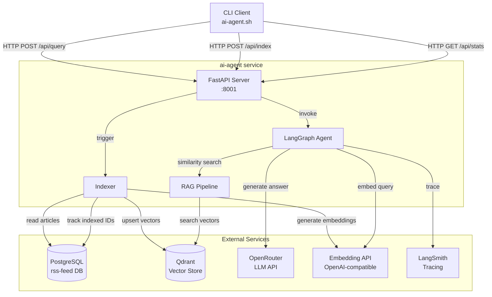
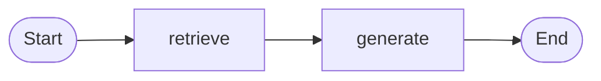

# Design Document: AI News Agent

## Overview

The AI News Agent is a Python service that provides intelligent question-answering over news articles collected by the existing rss-feed pipeline. It reads articles from the shared PostgreSQL database, indexes their text into a Qdrant vector store as embeddings, and uses a LangGraph-based agent to retrieve relevant chunks and generate answers via an LLM accessed through OpenRouter.

The system consists of three main components:
1. **Indexer** — reads extracted articles from PostgreSQL, chunks the text, generates embeddings, and upserts them into Qdrant
2. **LangGraph Agent** — orchestrates query embedding, vector retrieval, and LLM-based answer generation with source citations
3. **FastAPI Server** — exposes HTTP endpoints for querying the agent, triggering indexing, and health/stats checks

A bash CLI script (`scripts/ai-agent.sh`) provides terminal-based access to the agent API, matching the same pattern as the rss-feed CLI.

All LLM calls and agent workflows are traced via LangSmith when configured.

## Architecture



### Key Design Decisions

1. **Qdrant over pgvector**: Qdrant provides purpose-built HNSW indexing, payload filtering (for date ranges), and a dedicated management API. This avoids coupling vector operations to the relational database.

2. **LangGraph over plain LangChain**: LangGraph provides explicit state management and a graph-based workflow definition. This makes the retrieval-then-generation flow explicit and extensible (e.g., adding re-ranking or follow-up steps later).

3. **Shared PostgreSQL, read-only access to rss-feed tables**: The ai-agent reads articles from the existing rss-feed tables but never writes to them. It uses a separate `indexed_articles` table to track which articles have been processed.

4. **OpenAI-compatible embedding endpoint**: Both OpenRouter and dedicated embedding services (e.g., OpenAI, local models) expose the same `/v1/embeddings` API. This makes the embedding provider swappable via environment variables.

5. **Synchronous indexing via API trigger**: Indexing is triggered on-demand via an API endpoint rather than running as a background scheduler. This keeps the service stateless and lets the operator control when indexing happens (via CLI, cron, or manual trigger).

## Components and Interfaces

### Project Structure

```
ai-agent/
├── src/
│   ├── __init__.py
│   ├── main.py              # FastAPI app, lifespan, routes
│   ├── config.py             # Pydantic settings from env vars
│   ├── database.py           # SQLAlchemy async engine + session (shared PG)
│   ├── models.py             # SQLAlchemy models (Article read model + IndexedArticle)
│   ├── indexer.py            # Article chunking, embedding, Qdrant upsert
│   ├── rag.py                # Qdrant search, deduplication, retrieval logic
│   ├── agent.py              # LangGraph agent definition and invocation
│   ├── embeddings.py         # Embedding client (OpenAI-compatible API)
│   └── schemas.py            # Pydantic request/response models
├── tests/
│   ├── __init__.py
│   ├── conftest.py
│   ├── test_indexer.py
│   ├── test_rag.py
│   ├── test_agent.py
│   └── test_schemas.py
├── scripts/
│   ├── ai-agent.sh            # CLI client (bash, curl + jq)
│   └── fly-setup.sh
├── .env
├── .env.example
├── .dockerignore
├── .gitignore
├── Dockerfile
├── docker-compose.yml
├── fly.toml
├── pyproject.toml
└── README.md
```

### Component Interfaces

#### `config.py` — Settings

```python
class Settings(BaseSettings):
    # Database
    DATABASE_URL: str

    # Server
    APP_PORT: int = 8001

    # OpenRouter / LLM
    OPENROUTER_API_KEY: str
    LLM_MODEL: str = "openai/gpt-4o-mini"

    # Embedding
    EMBEDDING_MODEL: str = "openai/text-embedding-3-small"
    EMBEDDING_API_URL: str = "https://openrouter.ai/api/v1"
    EMBEDDING_API_KEY: str | None = None  # defaults to OPENROUTER_API_KEY

    # Qdrant
    QDRANT_URL: str = "http://localhost:6333"
    QDRANT_API_KEY: str | None = None
    QDRANT_COLLECTION: str = "article_chunks"

    # RAG
    RAG_TOP_K: int = 10
    RAG_MAX_CHUNKS_PER_ARTICLE: int = 3
    CHUNK_SIZE: int = 1000
    CHUNK_OVERLAP: int = 200

    # LangSmith
    LANGSMITH_API_KEY: str | None = None
    LANGSMITH_PROJECT: str = "sinalo-agent"
    LANGSMITH_TRACING: str = "true"
```

#### `embeddings.py` — Embedding Client

Thin wrapper around an OpenAI-compatible `/v1/embeddings` endpoint using `httpx`.

```python
class EmbeddingClient:
    def __init__(self, api_url: str, api_key: str, model: str): ...
    async def embed_texts(self, texts: list[str]) -> list[list[float]]: ...
    async def embed_query(self, text: str) -> list[float]: ...
```

- Batches embedding requests to avoid exceeding API limits
- Returns raw float vectors
- Raises `EmbeddingError` on API failure

#### `indexer.py` — Article Indexer

```python
class ArticleIndexer:
    def __init__(self, db_session_factory, embedding_client, qdrant_client, settings): ...
    async def index_articles(self, full_sync: bool = False) -> IndexingResult: ...
    def chunk_text(self, text: str, chunk_size: int, overlap: int) -> list[str]: ...
```

- `index_articles(full_sync=False)`: Reads unindexed articles from PG, chunks text, generates embeddings, upserts to Qdrant, records indexed IDs
- `chunk_text()`: Splits text into overlapping chunks at sentence boundaries
- Returns `IndexingResult` with counts (articles_processed, chunks_created, errors)

#### `rag.py` — RAG Pipeline (Retrieval)

```python
class RAGPipeline:
    def __init__(self, embedding_client, qdrant_client, settings): ...
    async def retrieve(self, query: str, date_from: datetime | None = None, date_to: datetime | None = None) -> list[RetrievedChunk]: ...
```

- Embeds the query, searches Qdrant with optional date filter, deduplicates by article_id (max N chunks per article), returns ranked chunks with metadata

#### `agent.py` — LangGraph Agent

```python
class NewsAgent:
    def __init__(self, rag_pipeline, llm_client, settings): ...
    async def query(self, user_query: str) -> AgentResponse: ...
```

- Defines a LangGraph `StateGraph` with nodes: `retrieve` → `generate`
- The `retrieve` node calls `RAGPipeline.retrieve()` and stores chunks in state
- The `generate` node builds a prompt with retrieved context and calls the LLM
- Returns `AgentResponse` with answer text, sources list, and metadata

#### `main.py` — FastAPI Application

Endpoints:
- `POST /api/query` — accepts `{"query": "..."}`, returns `{"answer": "...", "sources": [...], "query": "...", "processing_time_ms": ...}`
- `POST /api/index` — triggers indexing, accepts optional `{"full_sync": false}`, returns indexing stats
- `GET /api/stats` — returns indexing statistics
- `GET /health` — returns 200 if service, DB, and Qdrant are reachable

#### `scripts/ai-agent.sh` — CLI Client

POSIX-compatible shell script using `curl` + `jq`, matching the rss-feed CLI pattern:
- `ai-agent query "query text"` — sends query, displays formatted answer + sources
- `ai-agent query --json "query text"` — raw JSON output
- `ai-agent status` — shows indexing stats
- `ai-agent index` — triggers indexing
- `ai-agent help` — shows all commands

Reads `AI_AGENT_URL` from environment (default: `http://localhost:8001`). Supports `--json` flag on all commands. Displays errors with HTTP status code on stderr.

## Data Models

### PostgreSQL (existing rss-feed tables, read-only)

The ai-agent reads from the existing `articles` table. Key fields used:

| Field | Type | Usage |
|-------|------|-------|
| `id` | int (PK) | Unique article identifier, stored in Qdrant payload |
| `title` | varchar(1000) | Included in Qdrant payload for source citations |
| `url` | varchar(2048) | Included in Qdrant payload for source links |
| `published_at` | datetime | Included in Qdrant payload for date filtering |
| `extracted_text` | text | The content that gets chunked and embedded |
| `status` | varchar(20) | Only articles with `status = 'extracted'` are indexed |

### PostgreSQL (new table: `indexed_articles`)

Tracks which articles have been indexed to prevent duplicate processing.

```sql
CREATE TABLE indexed_articles (
    article_id INTEGER PRIMARY KEY REFERENCES articles(id) ON DELETE CASCADE,
    indexed_at TIMESTAMP NOT NULL DEFAULT NOW(),
    chunk_count INTEGER NOT NULL
);
```

SQLAlchemy model:

```python
class IndexedArticle(Base):
    __tablename__ = "indexed_articles"

    article_id: Mapped[int] = mapped_column(Integer, ForeignKey("articles.id", ondelete="CASCADE"), primary_key=True)
    indexed_at: Mapped[datetime] = mapped_column(DateTime, nullable=False, default=func.now())
    chunk_count: Mapped[int] = mapped_column(Integer, nullable=False)
```

### Qdrant Collection: `article_chunks`

| Config | Value |
|--------|-------|
| Distance metric | Cosine |
| Index type | HNSW |
| Vector dimension | Configurable (e.g., 1536 for text-embedding-3-small) |

Each point in the collection:

| Field | Type | Description |
|-------|------|-------------|
| `id` | UUID | Deterministic UUID from `article_id` + `chunk_index` |
| `vector` | float[] | Embedding vector |
| `payload.article_id` | int | FK to articles table |
| `payload.chunk_index` | int | Position of chunk within the article |
| `payload.chunk_text` | string | The actual chunk text |
| `payload.article_title` | string | Article title for citations |
| `payload.article_url` | string | Article URL for source links |
| `payload.published_at` | string (ISO) | Publication date for filtering |
| `payload.indexed_at` | string (ISO) | When this chunk was indexed |

The deterministic UUID is generated as `uuid5(NAMESPACE, f"{article_id}:{chunk_index}")` to enable idempotent upserts.

### Pydantic Schemas

```python
# Request
class QueryRequest(BaseModel):
    query: str = Field(..., min_length=1)

class IndexRequest(BaseModel):
    full_sync: bool = False

# Response
class SourceInfo(BaseModel):
    title: str
    url: str
    published_at: datetime | None

class QueryResponse(BaseModel):
    answer: str
    sources: list[SourceInfo]
    query: str
    processing_time_ms: float

class IndexingResult(BaseModel):
    articles_processed: int
    chunks_created: int
    errors: list[str]

class StatsResponse(BaseModel):
    total_articles_indexed: int
    total_chunks: int
    last_indexed_at: datetime | None

class HealthResponse(BaseModel):
    status: str
    database: str
    qdrant: str

class ErrorResponse(BaseModel):
    error: str
    message: str
    timestamp: datetime
```

### LangGraph Agent State

```python
class AgentState(TypedDict):
    query: str
    date_from: datetime | None
    date_to: datetime | None
    retrieved_chunks: list[RetrievedChunk]
    answer: str
    sources: list[SourceInfo]

class RetrievedChunk(BaseModel):
    chunk_text: str
    article_id: int
    article_title: str
    article_url: str
    published_at: datetime | None
    score: float
```

### LangGraph Workflow



- **retrieve**: Embeds the query, calls `RAGPipeline.retrieve()`, populates `retrieved_chunks` in state
- **generate**: Builds a prompt from the system instruction + retrieved chunks, calls the LLM via OpenRouter, populates `answer` and `sources` in state

The agent uses `langchain_openai.ChatOpenAI` configured with the OpenRouter base URL and API key. LangSmith tracing is enabled automatically when `LANGCHAIN_TRACING_V2=true` and `LANGCHAIN_API_KEY` are set (LangSmith uses these env var names internally).


## Correctness Properties

*A property is a characteristic or behavior that should hold true across all valid executions of a system — essentially, a formal statement about what the system should do. Properties serve as the bridge between human-readable specifications and machine-verifiable correctness guarantees.*

### Property 1: Article selection by indexing mode

*For any* set of articles in the database with various statuses and indexing states, when the indexer runs in incremental mode it should only process articles where `status = 'extracted'` AND `article_id` is not in `indexed_articles`. When run in full sync mode, it should process all articles where `status = 'extracted'`, regardless of prior indexing.

**Validates: Requirements 1.1, 1.7**

### Property 2: Text chunking respects configuration

*For any* non-empty text string and valid chunk_size/chunk_overlap configuration (where chunk_overlap < chunk_size), the `chunk_text` function should produce chunks where: (a) no chunk exceeds chunk_size by more than one sentence length, (b) consecutive chunks overlap by approximately chunk_overlap characters, and (c) concatenating all chunks (removing overlapping regions) reconstructs the original text.

**Validates: Requirements 1.2, 8.5**

### Property 3: Chunk metadata completeness round-trip

*For any* indexed article, every point stored in Qdrant should contain payload fields `article_id`, `chunk_index`, `chunk_text`, `article_title`, `article_url`, `published_at`, and `indexed_at`. When these chunks are retrieved, each `RetrievedChunk` should contain `chunk_text`, `article_title`, `article_url`, and `published_at`.

**Validates: Requirements 1.4, 3.5**

### Property 4: Indexing idempotence

*For any* article that has been successfully indexed, running the indexer again in incremental mode should not create duplicate entries in Qdrant or in the `indexed_articles` table. The total chunk count in Qdrant for that article should remain unchanged.

**Validates: Requirements 1.5**

### Property 5: Retrieval respects top-k and ordering

*For any* query and top_k configuration, the retrieval function should return at most top_k chunks, and the results should be ordered by descending similarity score.

**Validates: Requirements 3.2**

### Property 6: Date range filtering

*For any* query with a date_from and/or date_to filter, all returned chunks should have a `published_at` value that falls within the specified range (inclusive).

**Validates: Requirements 3.3**

### Property 7: Per-article deduplication cap

*For any* retrieval result set and configured `max_chunks_per_article` value, no single `article_id` should appear more than `max_chunks_per_article` times in the results.

**Validates: Requirements 3.4**

### Property 8: Query response structure completeness

*For any* successful query response from the `/api/query` endpoint, the JSON body should contain: `answer` (non-empty string), `sources` (array where each element has `title`, `url`, `published_at`), `query` (matching the original query string), and `processing_time_ms` (positive number).

**Validates: Requirements 5.2, 5.7**

### Property 9: Empty query validation

*For any* string that is empty or composed entirely of whitespace, submitting it to `POST /api/query` should return HTTP 422 with a validation error, and the agent should not be invoked.

**Validates: Requirements 5.3**

### Property 10: Stats accuracy

*For any* state of the `indexed_articles` table, the `GET /api/stats` endpoint should return `total_articles_indexed` equal to the count of rows in `indexed_articles`, `total_chunks` equal to the sum of `chunk_count` across all rows, and `last_indexed_at` equal to the maximum `indexed_at` value.

**Validates: Requirements 5.6**

### Property 11: CLI output contains all source information

*For any* agent response containing sources, the CLI formatted output should include the answer text and a numbered list where each entry contains the source title, URL, and publication date.

**Validates: Requirements 6.3**

### Property 12: CLI JSON mode round-trip

*For any* agent response, when the CLI is invoked with `--json`, the output should be valid JSON that is structurally identical to the raw API response.

**Validates: Requirements 6.4**

### Property 13: Startup validation for required environment variables

*For any* required environment variable (`DATABASE_URL`, `OPENROUTER_API_KEY`) that is missing, the application should fail to start and the error message should name the specific missing variable.

**Validates: Requirements 9.9**

### Property 14: Error response structure consistency

*For any* API error response (4xx or 5xx), the JSON body should contain `error` (string), `message` (string), and `timestamp` (ISO datetime string).

**Validates: Requirements 10.1**

## Error Handling

### Embedding API Failures

- If the embedding API is unreachable or returns an error during indexing, the indexer logs the error and skips the affected articles. Already-indexed articles are not affected. The indexer continues processing remaining articles.
- If the embedding API fails during a query, the agent returns HTTP 503 to the caller.

### LLM (OpenRouter) Failures

- On HTTP 429 (rate limit), the agent retries once after a 2-second delay. If the retry also fails, it returns HTTP 503.
- On other OpenRouter errors (5xx, timeout), the agent returns HTTP 503 with a message indicating the LLM service is temporarily unavailable.
- The full error is logged but not exposed to the client.

### Database Failures

- If the PostgreSQL connection is lost, SQLAlchemy's connection pool handles reconnection automatically.
- During a connection outage, all endpoints return HTTP 503.
- The `/health` endpoint reports `database: "unavailable"` when the connection check fails.

### Qdrant Failures

- If Qdrant is unreachable during indexing, the indexer logs the error and aborts the current batch.
- If Qdrant is unreachable during a query, the agent returns HTTP 503.
- The `/health` endpoint reports `qdrant: "unavailable"` when the Qdrant health check fails.

### Input Validation

- Missing or empty `query` field returns HTTP 422 with Pydantic validation details.
- All error responses use the consistent `ErrorResponse` schema with `error`, `message`, and `timestamp`.

### LangSmith Failures

- If `LANGSMITH_API_KEY` is not set or LangSmith is unreachable, the service operates normally without tracing. A warning is logged at startup.

## Testing Strategy

### Testing Framework

- **Unit/integration tests**: `pytest` with `pytest-asyncio` for async code
- **Property-based tests**: `hypothesis` (already used in the rss-feed project)
- **HTTP mocking**: `respx` for mocking httpx calls to external APIs
- **Test runner config**: `pytest` with `asyncio_mode = "auto"`

### Unit Tests

Unit tests cover specific examples, edge cases, and integration points:

- Chunking edge cases: empty text, text shorter than chunk_size, text with no sentence boundaries
- Embedding client: successful batch embedding, API error handling, empty input
- Qdrant collection creation: correct config (cosine distance, HNSW)
- Agent: system prompt contains citation instructions, empty retrieval produces "no results" message
- CLI: command dispatch, URL resolution (env var, default fallback), --json flag
- Health endpoint: returns 200 with correct structure when all services are up
- Stats endpoint: returns correct structure
- Index endpoint: triggers indexing and returns result
- OpenRouter retry: simulated 429 triggers one retry after delay
- Startup: missing DATABASE_URL raises clear error, missing OPENROUTER_API_KEY raises clear error
- LangSmith graceful degradation: service starts without LANGSMITH_API_KEY

### Property-Based Tests

Each property test uses `hypothesis` with a minimum of 100 examples. Each test is tagged with a comment referencing the design property.

```python
# Feature: ai-news-agent, Property 1: Article selection by indexing mode
# Feature: ai-news-agent, Property 2: Text chunking respects configuration
# Feature: ai-news-agent, Property 3: Chunk metadata completeness round-trip
# Feature: ai-news-agent, Property 4: Indexing idempotence
# Feature: ai-news-agent, Property 5: Retrieval respects top-k and ordering
# Feature: ai-news-agent, Property 6: Date range filtering
# Feature: ai-news-agent, Property 7: Per-article deduplication cap
# Feature: ai-news-agent, Property 8: Query response structure completeness
# Feature: ai-news-agent, Property 9: Empty query validation
# Feature: ai-news-agent, Property 10: Stats accuracy
# Feature: ai-news-agent, Property 11: CLI output contains all source information
# Feature: ai-news-agent, Property 12: CLI JSON mode round-trip
# Feature: ai-news-agent, Property 13: Startup validation for required environment variables
# Feature: ai-news-agent, Property 14: Error response structure consistency
```

Each correctness property is implemented by a single `@given(...)` decorated test function. Hypothesis strategies generate:
- Random article sets with varying statuses and indexing states (Properties 1, 4, 10)
- Random text strings of varying lengths (Property 2)
- Random article metadata (Properties 3, 8, 11, 12)
- Random top_k values and score lists (Properties 5, 7)
- Random date ranges and article dates (Property 6)
- Random whitespace strings (Property 9)
- Random required env var subsets (Property 13)
- Random HTTP error codes and messages (Property 14)

### Test Configuration

```toml
[tool.pytest.ini_options]
asyncio_mode = "auto"
testpaths = ["tests"]

[tool.hypothesis]
max_examples = 100
```

### Test Directory Structure

```
tests/
├── __init__.py
├── conftest.py           # Shared fixtures (mock DB, mock Qdrant, mock embedding client)
├── test_indexer.py        # Unit + property tests for indexer (Properties 1, 2, 3, 4)
├── test_rag.py            # Unit + property tests for retrieval (Properties 5, 6, 7)
├── test_agent.py          # Unit tests for agent workflow
├── test_api.py            # Unit + property tests for API endpoints (Properties 8, 9, 10, 13, 14)
├── test_cli.py            # Unit + property tests for CLI (Properties 11, 12)
└── test_schemas.py        # Schema validation tests
```
