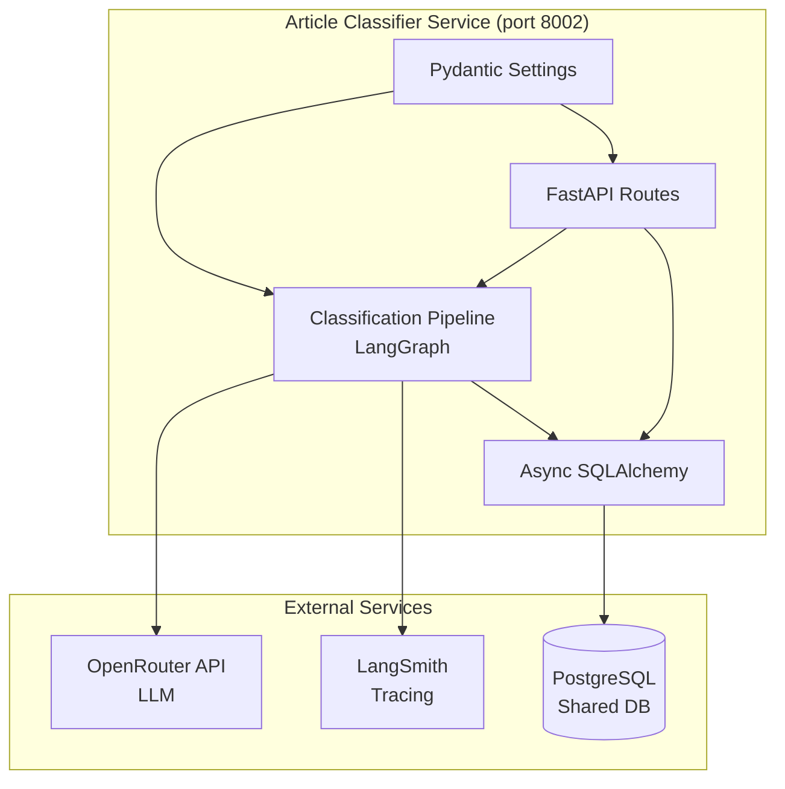
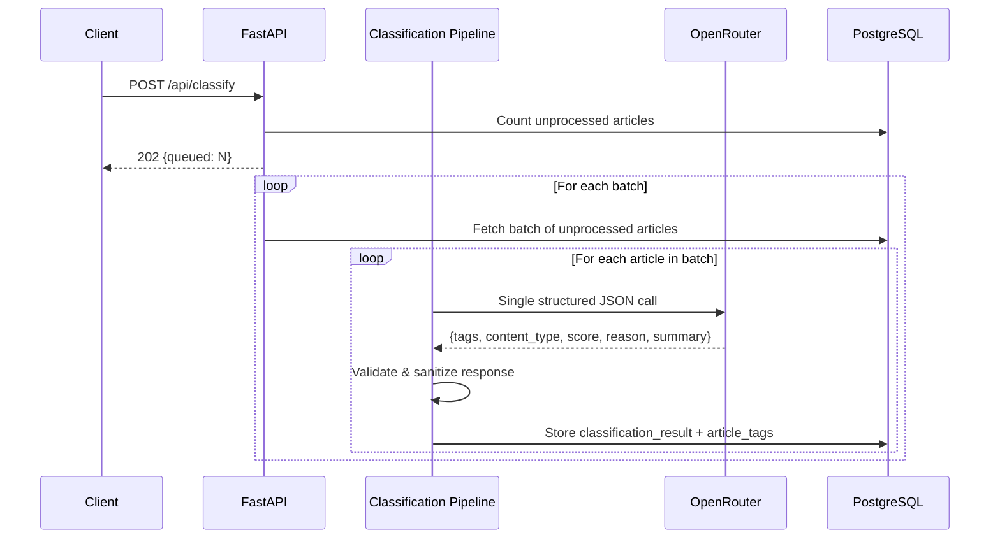
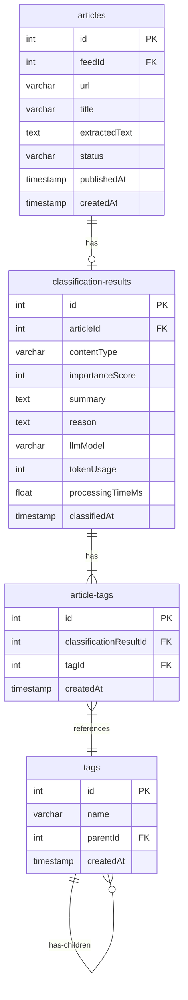

# Design Document: Article Classifier

## Overview

The Article Classifier is a FastAPI microservice that uses an LLM pipeline (LangGraph/LangChain + OpenRouter) to classify, tag, score, and summarize articles from the shared PostgreSQL database. It reads unprocessed articles from the `articles` table (owned by rss-feed service), processes them through a single LLM call that returns structured JSON, validates and persists the results, and exposes a REST API for querying classified articles.

The service follows the same architectural patterns as the existing rag-agent and rss-feed services: async SQLAlchemy for database access, pydantic-settings for configuration, structlog for structured logging, LangSmith for LLM tracing, and hatchling for builds.

### Key Design Decisions

1. **Single LLM call per article** — All classification fields (tags, content_type, score, reason, summary) are extracted in one structured JSON response to minimize API costs.
2. **Hardcoded tag taxonomy with dynamic expansion** — Initial categories and subcategories are defined as Python constants and seeded into the database at startup. The LLM receives the full existing tag list in its prompt and prioritizes matching existing tags. When a new tag is proposed, a lightweight LLM deduplication check determines if it's a synonym of an existing tag or genuinely new.
3. **Shared database, own tables** — The service reads from the rss-feed `articles` table but writes to its own dedicated tables (`classification_results`, `tags`, `article_tags`).
4. **Async background processing** — Classification runs asynchronously after the trigger endpoint returns, with a simple in-memory lock to prevent concurrent runs.
5. **Structured output with validation** — The LLM response is parsed into a Pydantic model, with fallback logic for invalid tags, out-of-range scores, and unknown content types.

## Architecture



### Request Flow: Classification Trigger



## Components and Interfaces

### Project Structure

Following the simple-project-structure rule, the service will have approximately 10 source files, so we organize into subdirectories:

```
article-classifier/
├── src/
│   ├── __init__.py
│   ├── main.py                 # FastAPI app, lifespan, structlog config
│   ├── config.py               # Pydantic settings
│   ├── constants.py            # Tag taxonomy, content type enum
│   ├── database.py             # Async SQLAlchemy engine, session factory
│   ├── models.py               # SQLAlchemy ORM models
│   ├── schemas.py              # Pydantic request/response schemas
│   ├── pipeline.py             # LangGraph classification pipeline
│   ├── classifier_service.py   # Business logic: fetch, process, store
│   └── routes.py               # FastAPI route handlers
├── alembic/
│   ├── env.py
│   └── versions/
│       └── 001_initial.py
├── alembic.ini
├── scripts/
│   ├── classifier.sh
│   ├── fly-setup.sh
│   └── start-docker.sh
├── tests/
│   ├── __init__.py
│   ├── conftest.py
│   ├── test_pipeline.py
│   └── test_routes.py
├── .env
├── .env.example
├── .dockerignore
├── .gitignore
├── Dockerfile
├── fly.toml
├── pyproject.toml
└── README.md
```

### Component Responsibilities

| Component | Responsibility |
|-----------|---------------|
| `main.py` | App creation, lifespan (LangSmith config, DB table creation, tag seeding), structlog setup, middleware |
| `config.py` | All environment variables via pydantic-settings |
| `constants.py` | `TAG_TAXONOMY` dict, `ContentType` enum, validation helpers |
| `database.py` | SQLAlchemy async engine, session factory, SSL handling |
| `models.py` | ORM models for classification_results, tags, article_tags |
| `schemas.py` | Pydantic models for API requests/responses and LLM structured output |
| `pipeline.py` | LangGraph graph: single-node pipeline that calls LLM with structured output prompt |
| `classifier_service.py` | Orchestration: fetch unprocessed articles, run pipeline, validate, persist results |
| `routes.py` | FastAPI router: /api/articles, /api/classify, /api/classify/status, /health |

### Key Interfaces

#### ClassificationPipeline

```python
class ClassificationPipeline:
    async def classify(self, article_title: str, article_text: str, article_summary: str | None) -> ClassificationOutput:
        """Run single LLM call, return validated structured output."""
        ...
```

#### ClassifierService

```python
class ClassifierService:
    async def get_unprocessed_articles(self, batch_size: int) -> list[Article]:
        """Fetch articles with extracted_text but no classification result."""
        ...

    async def classify_batch(self) -> ClassifyBatchResult:
        """Process one batch of unprocessed articles."""
        ...

    async def run_classification(self) -> None:
        """Process all unprocessed articles in batches until done."""
        ...
```

#### LLM Structured Output Schema

```python
class LLMClassificationResponse(BaseModel):
    tags: list[TagOutput]           # [{category: str, subcategory: str}]
    content_type: str               # One of ContentType enum values
    score: int                      # 0-10
    reason: str                     # English explanation
    summary: str                    # Czech summary in Markdown
```

## Data Models

### Database Schema



### SQLAlchemy Models

#### Tag

| Column | Type | Constraints |
|--------|------|-------------|
| id | Integer | PK, autoincrement |
| name | String(50) | NOT NULL |
| parent_id | Integer | FK → tags.id, NULL (NULL = main category) |
| created_at | DateTime | NOT NULL, default now() |
| | | UNIQUE(parent_id, name) |

#### ClassificationResult

| Column | Type | Constraints |
|--------|------|-------------|
| id | Integer | PK, autoincrement |
| article_id | Integer | FK → articles.id, NOT NULL, UNIQUE |
| content_type | String(30) | NOT NULL |
| importance_score | Integer | NOT NULL, CHECK(0-10) |
| summary | Text | NOT NULL |
| reason | Text | NOT NULL |
| llm_model | String(100) | NOT NULL |
| token_usage | Integer | NULL |
| processing_time_ms | Float | NULL |
| classified_at | DateTime | NOT NULL, default now() |

#### ArticleTag

| Column | Type | Constraints |
|--------|------|-------------|
| id | Integer | PK, autoincrement |
| classification_result_id | Integer | FK → classification_results.id, NOT NULL |
| tag_id | Integer | FK → tags.id, NOT NULL |
| created_at | DateTime | NOT NULL, default now() |
| | | UNIQUE(classification_result_id, tag_id) |

### Tag Taxonomy (Constants)

```python
TAG_TAXONOMY: dict[str, list[str]] = {
    "Politics": ["Czech", "European", "Global", "USA", "Diplomacy"],
    "Economy": ["Finance", "Markets", "Business", "Law", "Crypto", "Jobs"],
    "Technology": ["Software", "Hardware", "AI", "Cybersecurity", "Cloud", "Startups"],
    "Science": ["Research", "Space", "Medicine", "Energy", "Environment"],
    "Security": ["Military", "Conflict", "Terrorism", "Crime", "Defense"],
    "Society": ["Culture", "Education", "Health", "Sports", "Media"],
    "World": ["Disasters", "Migration", "Humanitarian", "Climate"],
}
```

### ContentType Enum

```python
class ContentType(str, Enum):
    CONSPIRACY_THEORY = "CONSPIRACY_THEORY"
    CLICKBAIT = "CLICKBAIT"
    NO_USEFUL_CONTENT = "NO_USEFUL_CONTENT"
    OPINION_EDITORIAL = "OPINION_EDITORIAL"
    BREAKING_NEWS = "BREAKING_NEWS"
    GENERAL_VALUABLE_CONTENT = "GENERAL_VALUABLE_CONTENT"
    UNIVERSAL_RELEVANT_CONTENT = "UNIVERSAL_RELEVANT_CONTENT"
```


## Correctness Properties

*A property is a characteristic or behavior that should hold true across all valid executions of a system — essentially, a formal statement about what the system should do. Properties serve as the bridge between human-readable specifications and machine-verifiable correctness guarantees.*

### Property 1: Unprocessed article selection

*For any* set of articles in the database (with varying combinations of null/non-null/empty extracted_text and presence/absence of classification results), the fetch function SHALL return exactly those articles where `extracted_text` is not null, not empty, and no corresponding `classification_results` record exists.

**Validates: Requirements 1.1, 1.3**

### Property 2: Tag validation and deduplication

*For any* list of tag objects returned by the LLM (containing arbitrary category/subcategory string combinations), the tag validation function SHALL: (a) map tags that match existing entries directly, (b) for unknown tags, perform a deduplication check — mapping to existing tags if identified as duplicates, or creating new tags if confirmed as genuinely new, and (c) ensure the final result count is between 1 and 5.

**Validates: Requirements 2.2, 2.5, 2.6, 2.7, 2.8**

### Property 3: Content type validation with fallback

*For any* string value returned by the LLM as content_type, the validation function SHALL return the same value if it matches a `ContentType` enum member, or `GENERAL_VALUABLE_CONTENT` if it does not match any enum member.

**Validates: Requirements 3.1, 3.3**

### Property 4: Score clamping

*For any* integer value returned by the LLM as importance score, the clamping function SHALL return `max(0, min(10, value))`, ensuring the result is always in the range [0, 10].

**Validates: Requirements 4.1, 4.5**

### Property 5: Short text bypass

*For any* article where `extracted_text` has fewer than 100 characters, the classification pipeline SHALL use the extracted text directly as the summary without invoking the LLM.

**Validates: Requirements 5.5**

### Property 6: API filtering correctness

*For any* set of classified articles and any combination of filter parameters (category, subcategory, content_type, min_score, date_from, date_to), every article in the response SHALL satisfy ALL applied filter conditions simultaneously (AND logic).

**Validates: Requirements 6.2, 6.3, 6.4, 6.5, 6.6, 6.10**

### Property 7: API sorting correctness

*For any* set of classified articles and any valid sort_by field (`importance_score`, `published_at`, `classified_at`) with sort_order (`asc` or `desc`), the returned articles SHALL be ordered according to the specified field and direction.

**Validates: Requirements 6.7, 6.8**

### Property 8: API pagination correctness

*For any* set of classified articles and valid pagination parameters (page ≥ 1, 1 ≤ size ≤ 100), the response SHALL contain at most `size` items, the `total` field SHALL equal the full filtered result count, and `pages` SHALL equal `ceil(total / size)`.

**Validates: Requirements 6.9**

## Error Handling

### LLM API Errors

| Error Type | Handling |
|-----------|----------|
| HTTP 429 (Rate Limit) | Retry after `LLM_RETRY_DELAY_SECONDS` (default 5s), up to `LLM_MAX_RETRIES` (default 3) |
| Non-retryable errors (4xx, 5xx) | Log error, mark article as `failed`, continue to next article |
| Invalid JSON response | Log warning, mark article as `failed`, continue |
| Timeout | Treat as retryable, same retry logic as 429 |

### Validation Errors

| Error Type | Handling |
|-----------|----------|
| Invalid tag (not in taxonomy) | Run LLM dedup check; if duplicate → map to existing; if new → create in DB; if dedup check fails → discard tag, log warning |
| All tags fail dedup/validation | Mark article as `failed`, log error |
| Invalid content_type | Default to `GENERAL_VALUABLE_CONTENT`, log warning |
| Score out of range | Clamp to [0, 10], log warning |
| Empty tags list after filtering | Mark article as `failed`, log error |
| Missing required fields in LLM response | Mark article as `failed`, log error |

### Database Errors

| Error Type | Handling |
|-----------|----------|
| Connection error during fetch | Retry up to 3 times with exponential backoff (1s, 2s, 4s) |
| Connection error during persist | Retry up to 3 times, then mark batch as failed |
| Constraint violation (duplicate article_id) | Skip article (already classified), log info |

### API Errors

| Error Type | Response |
|-----------|----------|
| Invalid query parameters | HTTP 422 with validation details |
| Classification already in progress | HTTP 409 with descriptive message |
| Database unreachable | HTTP 503 from /health endpoint |
| Unhandled exception | HTTP 500 with error type and message |

## Testing Strategy

### Property-Based Tests (Hypothesis)

The service uses [Hypothesis](https://hypothesis.readthedocs.io/) for property-based testing, with a minimum of 100 iterations per property. Each test references its design document property.

**Library**: `hypothesis>=6.100.0`
**Configuration**: `max_examples = 100` in `pyproject.toml`

Properties to implement:
- **Property 1**: Generate random article states, test fetch logic
- **Property 2**: Generate random tag lists with mix of valid/invalid entries, test validation
- **Property 3**: Generate random strings, test content type validation/fallback
- **Property 4**: Generate random integers (including extreme values), test clamping
- **Property 5**: Generate random strings of varying lengths, test short-text bypass
- **Property 6**: Generate random classified articles and filter params, test filtering
- **Property 7**: Generate random classified articles and sort params, test ordering
- **Property 8**: Generate random result sets and pagination params, test pagination math

Each test tagged with: `# Feature: article-classifier, Property {N}: {title}`

### Unit Tests (pytest)

- Endpoint response structure validation
- LLM prompt construction (verify title, text, summary included)
- Concurrent classification rejection (409 response)
- Health endpoint with mocked DB failure (503)
- Configuration defaults and required variable validation
- Tag seeding at startup

### Integration Tests

- Full classification flow with mocked LLM (end-to-end through pipeline)
- Database persistence of all classification fields
- Retry behavior with mocked 429 responses
- Failed article marking on non-retryable errors

### Test Structure

```
tests/
├── __init__.py
├── conftest.py              # Fixtures: test DB, mock LLM, sample articles
├── test_pipeline.py         # Property tests for validation logic (Properties 2-5)
├── test_service.py          # Property test for article selection (Property 1)
├── test_routes.py           # Property tests for API behavior (Properties 6-8)
└── test_integration.py      # Integration tests with mocked LLM
```

## CLI Script

A bash CLI script at `scripts/classifier.sh` provides a convenient interface for calling the service endpoints via curl. Follows the same pattern as `rss-feed/scripts/feed-parser.sh` and `rag-agent/scripts/rag-agent.sh`.

### Commands

| Command | Description |
|---------|-------------|
| `classifier classify` | Trigger classification of unprocessed articles |
| `classifier status` | Show classification processing status |
| `classifier articles [options]` | List classified articles with filters |
| `classifier health` | Check service health |
| `classifier help` | Show usage |

### Filter Options for `articles`

| Flag | Description |
|------|-------------|
| `--category=IT` | Filter by main category |
| `--subcategory=AI` | Filter by subcategory |
| `--type=BREAKING_NEWS` | Filter by content type |
| `--min-score=7` | Minimum importance score |
| `--from=2025-01-01` | Date from |
| `--to=2025-02-01` | Date to |
| `--sort=importance_score` | Sort field |
| `--order=desc` | Sort direction |
| `--page=1 --size=20` | Pagination |
| `--json` | Raw JSON output |

### Environment

| Variable | Default | Description |
|----------|---------|-------------|
| `CLASSIFIER_API_URL` | `http://localhost:8002` | Base URL of the classifier service |

### Examples

```bash
# Trigger classification
classifier classify

# Check status
classifier status

# Get top articles (score >= 7, no clickbait/conspiracy)
classifier articles --min-score=7 --type=BREAKING_NEWS

# Get all IT articles sorted by importance
classifier articles --category=IT --sort=importance_score --order=desc

# Get Czech politics articles
classifier articles --category=Politics --subcategory=Czech

# Raw JSON output
classifier articles --min-score=8 --json
```
