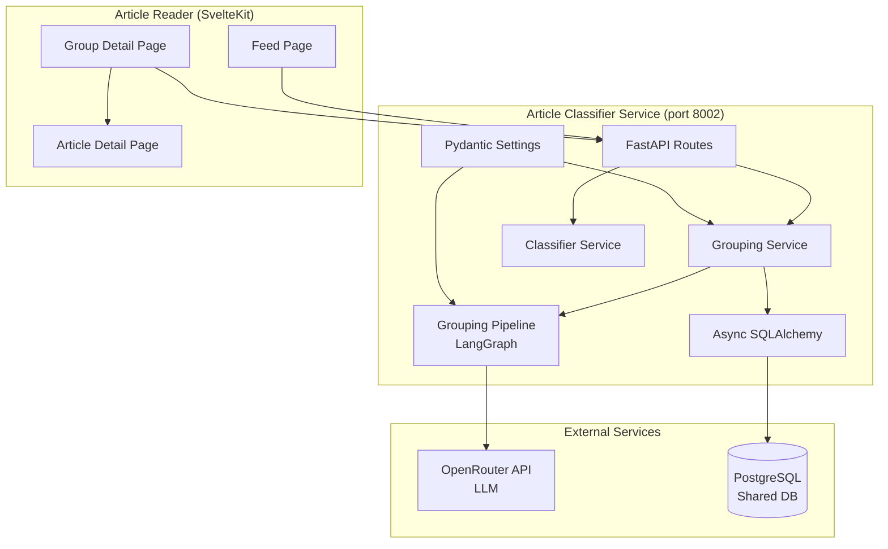
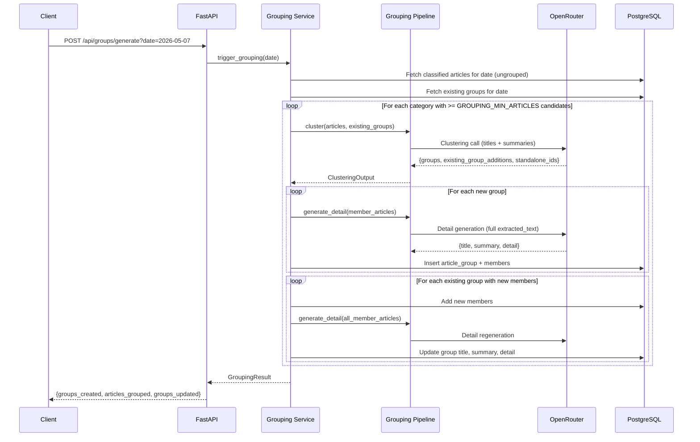
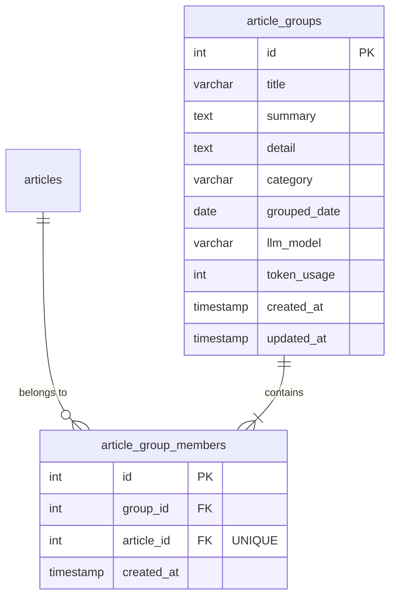

# Design Document: Article Grouping

## Overview

The Article Grouping feature is a post-classification pipeline that clusters similar articles covering the same topic within a single day and category, then generates consolidated AI summaries for each group. It integrates into the existing article-classifier service (Python/FastAPI) as a new module and extends the article-reader (SvelteKit) with group display capabilities.

The system performs two distinct LLM operations per grouping run:
1. **Clustering call** (one per category): Sends article titles and summaries to the LLM, which returns clusters of article IDs covering the same topic.
2. **Detail generation call** (one per new/updated group): Sends full `extracted_text` of member articles to generate a Czech-language title, short summary, and long combined article.

### Key Design Decisions

1. **Per-category clustering** — Articles are grouped by their first tag category before LLM comparison, reducing prompt size and ensuring cross-category articles are never grouped.
2. **Two-phase LLM calls** — Clustering uses only titles/summaries (cheap), while detail generation uses full text (expensive but only for new/changed groups).
3. **Incremental re-runs** — On re-run, existing groups are included in the clustering prompt so the LLM can assign new articles to them. Only groups that gain new members trigger detail regeneration.
4. **Mixed feed endpoint** — A new `/api/feed` endpoint interleaves groups and standalone articles, replacing the existing articles endpoint in the reader app.
5. **Grouped articles excluded from standalone feed** — Articles belonging to a group never appear as individual items in the feed.
6. **Synchronous processing** — Unlike classification (async background), grouping runs synchronously since it processes far fewer items (only one day's articles per category).

## Architecture



### Grouping Flow



## Components and Interfaces

### New Files

```
article-classifier/
├── src/
│   ├── grouping_service.py     # Orchestration: fetch candidates, run pipeline, persist
│   ├── grouping_pipeline.py    # LangGraph pipeline: clustering + detail generation
│   └── grouping_schemas.py     # Pydantic schemas for grouping LLM I/O and API responses
├── alembic/
│   └── versions/
│       └── 002_article_groups.py  # Migration for article_groups + article_group_members
└── tests/
    ├── test_grouping_service.py
    └── test_grouping_pipeline.py
```

### Modified Files

```
article-classifier/
├── src/
│   ├── config.py               # Add GROUPING_* settings
│   ├── models.py               # Add ArticleGroup, ArticleGroupMember models
│   └── routes.py               # Add /api/groups/*, /api/feed endpoints
├── scripts/
│   └── classifier.sh           # Add group, groups, group-detail commands
```

```
article-reader/
├── src/
│   ├── lib/
│   │   ├── api.ts              # Add getFeed, getGroupDetail functions
│   │   ├── types.ts            # Add FeedItem, GroupSummary, GroupDetail types
│   │   └── components/
│   │       └── GroupCard.svelte # New component for group display
│   └── routes/
│       ├── category/[slug]/
│       │   ├── +page.ts        # Switch to feed endpoint
│       │   └── +page.svelte    # Render GroupCard alongside ArticleCard
│       └── group/[id]/
│           ├── +page.ts        # Load group detail
│           └── +page.svelte    # Group detail screen
```

### Component Responsibilities

| Component | Responsibility |
|-----------|---------------|
| `grouping_service.py` | Orchestration: fetch candidates by date/category, invoke pipeline, persist groups, handle re-runs |
| `grouping_pipeline.py` | LangGraph graph with two nodes: clustering and detail generation. Handles LLM calls with structured output |
| `grouping_schemas.py` | Pydantic models for clustering LLM response, detail generation response, and API response schemas |
| `GroupCard.svelte` | Visual card component for groups in the feed list |
| `group/[id]/+page.svelte` | Group detail screen with combined article and member list |

### Key Interfaces

#### GroupingPipeline

```python
class GroupingPipeline:
    async def cluster(
        self,
        articles: list[ArticleForClustering],
        existing_groups: list[ExistingGroupForClustering],
    ) -> ClusteringOutput:
        """Single LLM call per category. Returns clusters + standalone IDs."""
        ...

    async def generate_detail(
        self,
        member_articles: list[ArticleForDetail],
    ) -> GroupDetailOutput:
        """Single LLM call per group. Returns title, summary, detail in Czech."""
        ...
```

#### GroupingService

```python
class GroupingService:
    async def run_grouping(self, target_date: date | None = None) -> GroupingResult:
        """Run full grouping pipeline for a date. Returns stats."""
        ...

    async def get_candidates(
        self, session: AsyncSession, target_date: date
    ) -> dict[str, list[Article]]:
        """Fetch ungrouped classified articles, grouped by first tag category."""
        ...

    async def get_existing_groups(
        self, session: AsyncSession, target_date: date
    ) -> dict[str, list[ArticleGroup]]:
        """Fetch existing groups for the date, grouped by category."""
        ...
```

#### Feed Endpoint Response Types

```python
class FeedItem(BaseModel):
    type: Literal["article", "group"]
    # Common fields
    id: int
    title: str | None
    summary: str | None
    category: str
    importance_score: int
    tags: list[TagResponse] = []
    # Article-specific (None for groups)
    url: str | None = None
    author: str | None = None
    published_at: datetime | None = None
    content_type: str | None = None
    classified_at: datetime | None = None
    # Group-specific (None for articles)
    grouped_date: date | None = None
    member_count: int | None = None
```

**Computed fields for groups (not stored in DB, calculated at query time):**
- `importance_score` = maximum `importance_score` among all member articles
- `tags` = union of all tags from all member articles (deduplicated)

## Data Models

### Database Schema (New Tables)



### SQLAlchemy Models

#### ArticleGroup

| Column | Type | Constraints |
|--------|------|-------------|
| id | Integer | PK, autoincrement |
| title | String(500) | NOT NULL |
| summary | Text | NOT NULL |
| detail | Text | NOT NULL |
| category | String(50) | NOT NULL |
| grouped_date | Date | NOT NULL |
| llm_model | String(200) | NULL |
| token_usage | Integer | NULL |
| created_at | DateTime | NOT NULL, default now() |
| updated_at | DateTime | NOT NULL, default now(), onupdate now() |

Indexes: `(category, grouped_date)` composite index for feed queries.

#### ArticleGroupMember

| Column | Type | Constraints |
|--------|------|-------------|
| id | Integer | PK, autoincrement |
| group_id | Integer | FK → article_groups.id, NOT NULL, ON DELETE CASCADE |
| article_id | Integer | FK → articles.id, NOT NULL, UNIQUE |
| created_at | DateTime | NOT NULL, default now() |

The UNIQUE constraint on `article_id` enforces the one-article-one-group invariant.

### LLM Structured Output Schemas

#### Clustering Response

```python
class ClusterItem(BaseModel):
    article_ids: list[int]
    topic: str
    justification: str

class ExistingGroupAddition(BaseModel):
    group_id: int
    article_ids: list[int]

class ClusteringLLMResponse(BaseModel):
    groups: list[ClusterItem]
    existing_group_additions: list[ExistingGroupAddition]
    standalone_ids: list[int]
```

#### Detail Generation Response

```python
class GroupDetailLLMResponse(BaseModel):
    title: str
    summary: str
    detail: str
```

### Configuration Extensions

```python
# Added to Settings class in config.py
GROUPING_LLM_MODEL: str | None = None  # Falls back to LLM_MODEL
GROUPING_MIN_ARTICLES: int = 2
GROUPING_MAX_ARTICLES_PER_CATEGORY: int = 50
```

### Frontend Types

```typescript
// New types in article-reader/src/lib/types.ts
export interface FeedItem {
    type: 'article' | 'group';
    id: number;
    title: string | null;
    summary: string | null;
    category: string;
    importance_score: number;
    tags: Tag[];
    // Article fields
    url?: string | null;
    author?: string | null;
    published_at?: string | null;
    content_type?: string;
    classified_at?: string;
    // Group fields
    grouped_date?: string | null;
    member_count?: number;
}

export interface GroupDetail {
    id: number;
    title: string;
    summary: string;
    detail: string;  // Markdown
    category: string;
    grouped_date: string;
    member_count: number;
    created_at: string;
    members: GroupMemberArticle[];
}

export interface GroupMemberArticle {
    id: number;
    title: string | null;
    url: string | null;
    author: string | null;
    published_at: string | null;
    summary: string | null;
    importance_score: number;
}

export interface FeedResponse {
    items: FeedItem[];
    total: number;
    page: number;
    size: number;
    pages: number;
}
```


## Correctness Properties

*A property is a characteristic or behavior that should hold true across all valid executions of a system — essentially, a formal statement about what the system should do. Properties serve as the bridge between human-readable specifications and machine-verifiable correctness guarantees.*

### Property 1: Candidate selection correctness

*For any* set of articles in the database with varying combinations of `published_at` dates, classification result presence/absence, summary presence/absence, and group membership status, the candidate selection function SHALL return exactly those articles where: (a) `published_at` falls on the target date, (b) a classification result with a non-empty summary exists, and (c) no `article_group_members` record exists for that article.

**Validates: Requirements 1.1, 1.4**

### Property 2: Category partitioning correctness

*For any* set of candidate articles with varying tag assignments, the category partitioning function SHALL produce a dictionary where each key is a main category string and each value contains only articles whose first assigned tag belongs to that category — no article appears in more than one category bucket.

**Validates: Requirements 1.2, 1.3**

### Property 3: Minimum articles threshold

*For any* category partition and any GROUPING_MIN_ARTICLES threshold value, the grouping service SHALL invoke the clustering pipeline only for categories that have at least GROUPING_MIN_ARTICLES candidate articles — categories below the threshold SHALL be skipped entirely.

**Validates: Requirements 1.5**

### Property 4: Clustering output validation

*For any* clustering LLM response containing groups of article IDs, the validation function SHALL: (a) discard any group containing fewer than 2 articles (treating those articles as standalone), and (b) if any article ID appears in multiple groups, assign it only to the first group encountered — ensuring each article belongs to at most one group in the final output.

**Validates: Requirements 2.8, 2.9**

### Property 5: Group list filtering and pagination

*For any* set of article groups with varying categories, grouped_dates, and member counts, and any combination of filter parameters (category, date, date_from, date_to) with pagination (page, size), the groups list endpoint SHALL return only groups satisfying ALL filter conditions, with at most `size` items per page, correct `total` count, and `pages = ceil(total / size)`.

**Validates: Requirements 6.1, 6.2, 6.3, 6.4, 6.9**

### Property 6: Feed exclusion invariant

*For any* set of articles where some belong to groups and some are standalone, the feed endpoint SHALL never return an article that is a member of any Article_Group as a standalone item — grouped articles appear only as part of their group's `member_count`.

**Validates: Requirements 7.1, 7.8**

### Property 7: Feed filtering correctness

*For any* mixed feed of groups and standalone articles, and any combination of filter parameters (category, date_from, date_to, min_score, subcategory): (a) every returned standalone article SHALL satisfy all filter conditions directly, (b) every returned group SHALL satisfy category and date filters on its own fields, min_score filter using the maximum importance_score among its members, and subcategory filter if at least one member article has the specified subcategory tag.

**Validates: Requirements 7.2, 7.3, 7.4, 7.5, 7.11, 7.12**

### Property 8: Feed sorting and pagination

*For any* mixed feed response, items SHALL be sorted by date in ascending order (using `published_at` for articles and `grouped_date` for groups), and pagination SHALL return at most `size` items with correct `total` and `pages` values.

**Validates: Requirements 7.9, 7.10**

### Property 9: Max articles per category truncation

*For any* category with candidate articles exceeding GROUPING_MAX_ARTICLES_PER_CATEGORY, the service SHALL pass only the most recent articles (by `published_at`) up to the limit to the clustering pipeline — older articles beyond the limit SHALL be excluded.

**Validates: Requirements 11.5**

## Error Handling

### LLM API Errors

| Error Type | Handling |
|-----------|----------|
| HTTP 429 (Rate Limit) | Retry after configurable delay, up to 3 times |
| Non-retryable errors (4xx, 5xx) | Log error, skip the category (for clustering) or skip the group (for detail generation) |
| Invalid JSON / parsing failure | Log warning, skip the affected category or group |
| Timeout | Treat as retryable, same retry logic as 429 |

### Clustering Validation Errors

| Error Type | Handling |
|-----------|----------|
| Single-article group returned | Discard group, treat article as standalone |
| Article ID not in candidate set | Ignore the invalid ID, log warning |
| Article appears in multiple groups | Assign to first group only, log warning |
| Empty groups list returned | Treat all articles as standalone for that category |
| existing_group_additions references non-existent group | Ignore that addition, log warning |

### Database Errors

| Error Type | Handling |
|-----------|----------|
| Unique constraint violation on article_id | Article already in a group — skip, log info |
| Foreign key violation | Referenced article doesn't exist — skip member, log warning |
| Transaction failure | Roll back entire category's grouping operation, log error, continue with next category |

### API Errors

| Error Type | Response |
|-----------|----------|
| Invalid date format | HTTP 422 with validation details |
| Group ID not found | HTTP 404 |
| Invalid query parameters | HTTP 422 with validation details |
| Grouping pipeline failure | HTTP 500 with error description |

## Testing Strategy

### Property-Based Tests (Hypothesis)

The service uses [Hypothesis](https://hypothesis.readthedocs.io/) for property-based testing, with a minimum of 100 iterations per property. Each test references its design document property.

**Library**: `hypothesis>=6.100.0` (already in dev dependencies)
**Configuration**: `max_examples = 100` in `pyproject.toml`

Properties to implement:
- **Property 1**: Generate random article sets with varying dates, classification states, and group memberships. Test candidate selection query logic.
- **Property 2**: Generate random articles with varying tag assignments. Test category partitioning function.
- **Property 3**: Generate random category partitions with varying sizes and threshold values. Test skip logic.
- **Property 4**: Generate random clustering LLM responses with edge cases (single-article groups, duplicate IDs). Test validation/sanitization function.
- **Property 5**: Generate random groups with varying attributes and filter/pagination params. Test group list endpoint filtering.
- **Property 6**: Generate random articles with some grouped and some standalone. Test feed endpoint exclusion logic.
- **Property 7**: Generate random mixed feed data with varying filter params. Test feed filtering for both articles and groups.
- **Property 8**: Generate random mixed feed data. Test sorting order and pagination math.
- **Property 9**: Generate random candidate lists of varying sizes. Test truncation to max limit with recency ordering.

Each test tagged with: `# Feature: article-grouping, Property {N}: {title}`

### Unit Tests (pytest)

- Clustering prompt construction (verify articles, existing groups included)
- Detail generation prompt construction (verify full extracted_text included)
- Re-run behavior: existing groups passed to clustering, unchanged groups not regenerated
- API endpoint response structure validation
- Group detail endpoint with member articles
- Default date parameter (today) when not specified
- Transaction rollback on partial failure

### Integration Tests

- Full grouping flow with mocked LLM (end-to-end: candidates → clustering → detail → persistence)
- Re-run with existing groups and new articles (mocked LLM returns additions)
- Feed endpoint with real DB data (groups + standalone articles mixed)
- Retry behavior with mocked 429 responses
- CLI script commands against running service

### Test Structure

```
tests/
├── test_grouping_service.py    # Property tests 1-3, 9 + unit tests for orchestration
├── test_grouping_pipeline.py   # Property test 4 + unit tests for prompt construction
├── test_routes.py              # Property tests 5-8 (extend existing file)
└── test_grouping_integration.py # Integration tests with mocked LLM
```
