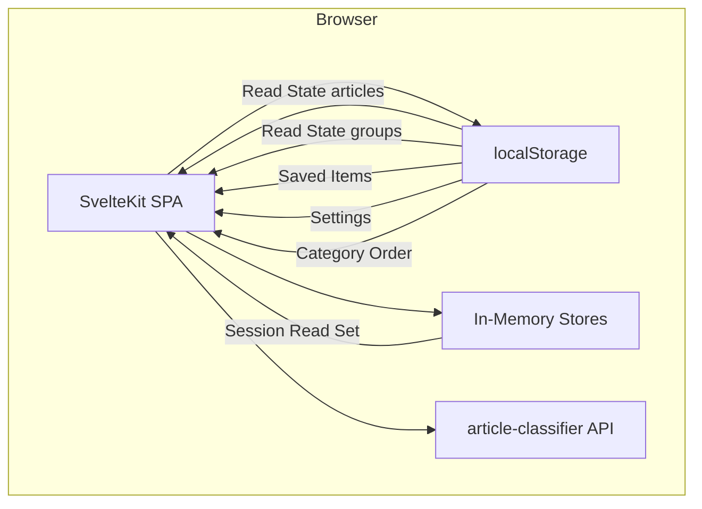
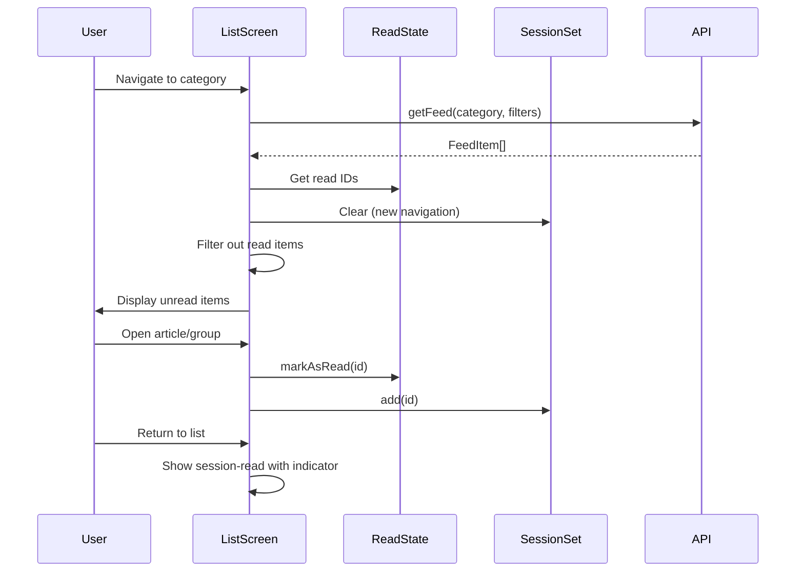
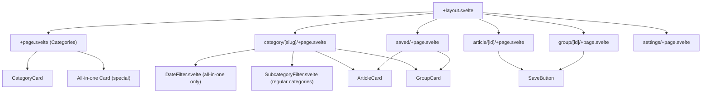

# Design Document: Article Reader Enhancements

## Overview

This design extends the existing Article Reader SvelteKit SPA with five enhancements: an "All in one" aggregated category view with date-based filtering, automatic hiding of read articles/groups on re-entry with session-read visibility, group-level read state tracking, a saved/bookmarked items feature, and publication time display.

All enhancements are client-side only — no backend changes required. The existing feed API already supports the query parameters needed (category, date_from, date_to, min_score). New state is managed via additional localStorage stores and in-memory session state.

### Key Design Decisions

1. **Group read state uses a separate localStorage key** (`article-reader:read-groups`) storing group IDs as numbers. This avoids prefix-parsing complexity and keeps the existing article read state store unchanged.
2. **Session read set is in-memory only** — a Svelte store (not persisted) that tracks IDs read during the current list view session. Cleared on navigation away from the list screen.
3. **Saved items store uses a single localStorage key** (`article-reader:saved-items`) storing `{ articles: number[], groups: number[] }`. Items are stored in insertion order (newest saved appended to end), and displayed in reverse order (most recently saved first).
4. **"All in one" reuses the category/[slug] route** with a reserved slug `__all__`. The load function detects this slug and fetches without a category filter.
5. **Date filter is client-side** — all items are fetched for the settings date range, then filtered in-memory by the selected date. This avoids extra API calls when switching dates.
6. **Read filtering happens at the component level** — the load function returns all items, and the Svelte component filters out read items (except session-read ones) before rendering.
7. **Publication time formatting** uses `Intl.DateTimeFormat` with the user's locale for consistent time display.

## Architecture



### Data Flow for Read Filtering



### New Routes

```
src/routes/
├── saved/+page.svelte, +page.ts    # Saved Items Page (NEW)
```

The "All in one" view reuses `category/[slug]` with slug `__all__`. No new route needed.

## Components and Interfaces

### New Components

| Component | Props | Responsibility |
|-----------|-------|----------------|
| `DateFilter` | `dates: string[], selected: string \| null, onSelect: (date) => void` | Horizontal scrollable date chip selector for the all-in-one view |
| `SaveButton` | `isSaved: boolean, onToggle: () => void` | Bookmark toggle button (filled/outline icon) |
| `SavedPage` | — | Page displaying all saved articles and groups |

### Modified Components

| Component | Changes |
|-----------|---------|
| `CategoryCard` | Updated to display total count, read count, and unread count (e.g., "3 read / 7 unread / 10 total") |
| `+page.svelte` (home) | Adds "All in one" card at top, outside drag-and-drop area |
| `category/[slug]/+page.svelte` | Adds read filtering, session read set, date filter for `__all__` slug, "Mark as read" on GroupCard |
| `category/[slug]/+page.ts` | Detects `__all__` slug, fetches without category filter |
| `GroupCard` | Adds read/unread indicator, "Mark as read" button, publication time |
| `ArticleCard` | Adds publication time display |
| `article/[id]/+page.svelte` | Adds save button |
| `group/[id]/+page.svelte` | Adds save button, marks group as read (not just members) |
| `+layout.svelte` | Adds navigation link to saved page |

### New Stores

```typescript
// src/lib/stores/groupReadState.ts
// Writable store backed by localStorage
// Key: 'article-reader:read-groups'
// Value: number[] (group IDs that have been read)

// src/lib/stores/savedItems.ts
// Writable store backed by localStorage
// Key: 'article-reader:saved-items'
// Value: { articles: number[], groups: number[] }

// src/lib/stores/sessionReadSet.ts
// Writable store NOT persisted (in-memory only)
// Value: Set<string> where strings are 'article:ID' or 'group:ID'
// Cleared on navigation away from list screen
```

### Component Hierarchy (Updated)



## Data Models

### New TypeScript Interfaces

```typescript
// Additions to src/lib/types.ts

export interface SavedItems {
  articles: number[];
  groups: number[];
}
```

### localStorage Schema (Updated)

| Key | Type | Default | Description |
|-----|------|---------|-------------|
| `article-reader:read-articles` | `number[]` (JSON) | `[]` | Article IDs the user has read |
| `article-reader:read-groups` | `number[]` (JSON) | `[]` | Group IDs the user has read |
| `article-reader:saved-items` | `SavedItems` (JSON) | `{ "articles": [], "groups": [] }` | Bookmarked article and group IDs |
| `article-reader:settings` | `Settings` (JSON) | `{ "minScore": 6, "daysBack": 7 }` | User filter preferences |
| `article-reader:category-order` | `string[]` (JSON) | `[]` | User's custom category ordering |

### Date Formatting Utility

```typescript
// Addition to src/lib/utils.ts

export function formatDateTime(dateStr: string | null): string {
  if (!dateStr) return '';
  const date = new Date(dateStr);
  return date.toLocaleDateString(undefined, {
    year: 'numeric',
    month: 'short',
    day: 'numeric'
  }) + ' ' + date.toLocaleTimeString(undefined, {
    hour: '2-digit',
    minute: '2-digit'
  });
}

export function formatDateOnly(dateStr: string): string {
  return new Date(dateStr).toISOString().split('T')[0];
}

export function extractUniqueDates(items: FeedItem[]): string[] {
  const dates = new Set<string>();
  for (const item of items) {
    const dateStr = item.published_at ?? item.grouped_date;
    if (dateStr) {
      dates.add(formatDateOnly(dateStr));
    }
  }
  return Array.from(dates).sort().reverse(); // newest first
}

export function getTodayDateString(): string {
  return new Date().toISOString().split('T')[0];
}
```

### Read Filtering Logic

```typescript
// src/lib/utils.ts addition

export function filterReadItems(
  items: FeedItem[],
  readArticleIds: number[],
  readGroupIds: number[],
  sessionReadSet: Set<string>
): FeedItem[] {
  return items.filter((item) => {
    const key = `${item.type}:${item.id}`;
    // Always show session-read items
    if (sessionReadSet.has(key)) return true;
    // Hide persistently read items
    if (item.type === 'article' && readArticleIds.includes(item.id)) return false;
    if (item.type === 'group' && readGroupIds.includes(item.id)) return false;
    return true;
  });
}
```

### Sorting Logic for All-in-One View

```typescript
// src/lib/utils.ts addition

export function sortByDateThenImportance(items: FeedItem[]): FeedItem[] {
  return [...items].sort((a, b) => {
    const dateA = a.published_at ?? a.grouped_date ?? '';
    const dateB = b.published_at ?? b.grouped_date ?? '';
    // Date descending
    const dateCmp = dateB.localeCompare(dateA);
    if (dateCmp !== 0) return dateCmp;
    // Importance descending within same date
    return b.importance_score - a.importance_score;
  });
}
```


## Correctness Properties

*A property is a characteristic or behavior that should hold true across all valid executions of a system — essentially, a formal statement about what the system should do. Properties serve as the bridge between human-readable specifications and machine-verifiable correctness guarantees.*

### Property 1: Sort order invariant (date descending, then importance descending)

*For any* array of FeedItems with various `published_at`/`grouped_date` and `importance_score` values, after applying `sortByDateThenImportance`, for all adjacent pairs (a, b) in the result: the date of a is greater than or equal to the date of b, and if the dates are equal, the importance score of a is greater than or equal to the importance score of b.

**Validates: Requirements 1.4**

### Property 2: Date extraction produces exactly the unique dates present in items

*For any* array of FeedItems, `extractUniqueDates` SHALL return a set of date strings that is exactly equal to the set of unique date portions (YYYY-MM-DD) derived from each item's `published_at` or `grouped_date` field (excluding null values), sorted in reverse chronological order.

**Validates: Requirements 2.2**

### Property 3: Date filtering retains only items matching the selected date

*For any* array of FeedItems and any selected date string, filtering items by that date SHALL produce a result where every item has a `published_at` or `grouped_date` whose date portion equals the selected date, and no item from the original array matching that date is excluded from the result.

**Validates: Requirements 2.4**

### Property 4: Read filtering excludes all read items when session set is empty

*For any* array of FeedItems, any set of read article IDs, and any set of read group IDs, calling `filterReadItems` with an empty session read set SHALL produce a result containing no articles whose ID is in the read article set and no groups whose ID is in the read group set.

**Validates: Requirements 3.1, 3.2, 3.3**

### Property 5: Session read items are preserved in filtered output

*For any* array of FeedItems where some items are both in the persistent read state AND in the session read set, calling `filterReadItems` SHALL retain those session-read items in the output (they are not filtered out).

**Validates: Requirements 3.4**

### Property 6: Unread count equals total items minus read items

*For any* array of FeedItems, any set of read article IDs, and any set of read group IDs, the count of unread items SHALL equal the total number of items minus the number of items whose IDs appear in the corresponding read set.

**Validates: Requirements 3.6**

### Property 7: Group read state round-trip

*For any* group ID, marking it as read in the group read state store and then querying `isGroupRead` SHALL return true. For any group ID NOT marked as read, `isGroupRead` SHALL return false. Group read state SHALL not affect article read state and vice versa.

**Validates: Requirements 3a.1, 3a.3, 3a.5**

### Property 8: Marking a group as read cascades to all member articles

*For any* group ID and any array of member article IDs, when the group is marked as read, all member article IDs SHALL appear in the article read state store.

**Validates: Requirements 3a.4**

### Property 9: Saved items toggle is its own inverse

*For any* item type (article or group) and any item ID, toggling save on an unsaved item SHALL add it to the saved items store, and toggling save again SHALL remove it. After two toggles, the store state for that item SHALL be identical to the initial state.

**Validates: Requirements 4.4, 4.5**

### Property 10: Saved items persistence round-trip

*For any* valid SavedItems object (with arrays of non-negative integer IDs), persisting to localStorage and then loading SHALL produce an identical SavedItems object.

**Validates: Requirements 4.10**

### Property 11: DateTime formatting includes both date and time components

*For any* valid ISO 8601 date-time string with a non-midnight time component, `formatDateTime` SHALL produce a string that contains a recognizable date portion and a recognizable time portion (with hours and minutes). For null input, it SHALL return an empty string.

**Validates: Requirements 5.1, 5.2, 5.3, 5.5**

## Error Handling

| Scenario | Behavior |
|----------|----------|
| API unreachable when loading feed | Display "Service unavailable" with retry button |
| API returns 404 for saved article/group | Display item as "unavailable" with remove-from-saved option |
| Invalid localStorage data (read state, saved items) | Reset to defaults, log warning to console |
| No articles for selected date in all-in-one view | Display empty state: "No articles for this date" |
| Group detail fails to load (404 or network error) | Display error with back navigation |
| Saved items store corrupted | Reset to `{ articles: [], groups: [] }`, log warning |
| Group read state corrupted | Reset to `[]`, log warning |

### Error Recovery Patterns

All stores follow the same defensive loading pattern already established in `readState.ts` and `settings.ts`:
1. Attempt to parse localStorage JSON
2. Validate the shape (array of numbers, correct object structure)
3. If invalid, reset to default and log a console warning
4. Never throw — always return a safe default

## Testing Strategy

### Property-Based Testing

**Library**: [fast-check](https://github.com/dubzzz/fast-check) (already installed in the project)

**Configuration**: Minimum 100 iterations per property test.

**Tag format**: `Feature: article-reader-enhancements, Property {number}: {property_text}`

The following pure logic functions are suitable for property-based testing:
- `sortByDateThenImportance` — sorting invariant
- `extractUniqueDates` — date extraction
- Date filtering logic — correctness of date matching
- `filterReadItems` — read filtering with session set
- `createGroupReadStateStore` — group read state round-trip
- `createSavedItemsStore` — saved items toggle and persistence
- `formatDateTime` — date-time formatting

Each correctness property (1–11) maps to a single property-based test.

### Unit Tests (Vitest + fast-check)

```
article-reader/tests/
├── unit/
│   ├── sorting.test.ts          # Property 1: sort invariant
│   ├── dateExtraction.test.ts   # Property 2: unique date extraction
│   ├── dateFiltering.test.ts    # Property 3: date filter correctness
│   ├── readFiltering.test.ts    # Properties 4, 5, 6: read filtering
│   ├── groupReadState.test.ts   # Properties 7, 8: group read state
│   ├── savedItems.test.ts       # Properties 9, 10: saved items store
│   └── formatDateTime.test.ts   # Property 11: date-time formatting
├── integration/
│   └── savedPage.test.ts        # Saved page API integration
```

### Example-Based Tests

In addition to property tests, example-based tests cover:
- UI rendering (all-in-one card position, date filter visibility, save button states)
- Navigation behavior (clicking all-in-one navigates to correct route)
- Session read set lifecycle (cleared on navigation)
- Edge cases (null dates, empty lists, corrupted localStorage)

### Integration Tests

- Saved page fetches data for each saved item ID from the API
- API 404 handling for deleted saved items
- Full navigation flow: home → all-in-one → article → back (with read filtering)
