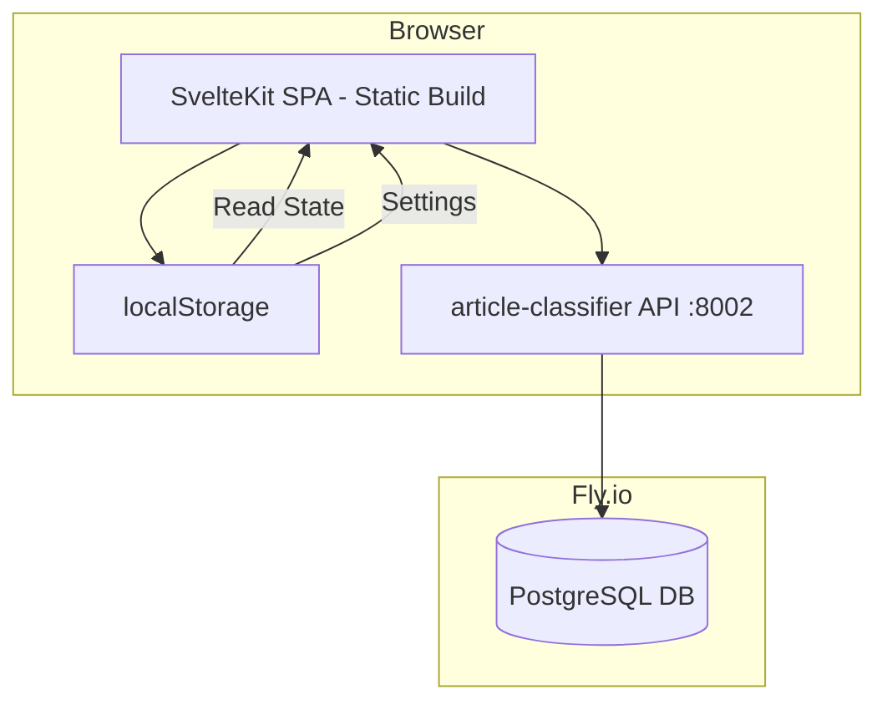
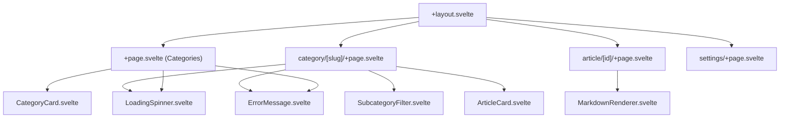

# Design Document: Article Reader

## Overview

The Article Reader is a SvelteKit web application that provides a clean, reader-friendly interface for browsing classified articles from the article-classifier API. It implements a three-screen navigation flow (Category Selection → Article List → Article Detail) with local state management via browser localStorage for read tracking and user settings.

The application is a pure client-side SPA (Single Page Application) built with SvelteKit's `adapter-static`. It has no server component — all API calls go directly from the browser to the article-classifier API. All persistent user state lives in localStorage, and all article data comes from the article-classifier API. The article-classifier API must have CORS enabled for the reader's origin.

### Key Design Decisions

1. **Pure SPA (adapter-static)**: No server-side code. The app is built as static HTML/JS/CSS and served from any static hosting (Nginx, Caddy, Cloudflare Pages, or a simple container on Fly.io).
2. **Direct API calls**: The browser calls the article-classifier API directly. The API URL is configured at build time via a public environment variable.
3. **Client-side state only**: Read state and settings live in localStorage — no user accounts or server-side sessions needed.
4. **No offline support**: The app requires network connectivity; no service workers or caching layers.
5. **Markdown rendering**: Article summaries support markdown formatting via a lightweight client-side library (marked or similar).
6. **Capacitor-ready**: No server dependency means the app works identically in a Capacitor shell — just point the API URL to the production backend.

## Architecture



### Data Flow

1. **Page Load**: SvelteKit client-side `+page.ts` load functions call the article-classifier API directly via fetch
2. **API Calls**: All requests go directly from the browser to the article-classifier API (CORS must be enabled on the API)
3. **Client State**: Read/unread state and settings are read/written directly to localStorage from Svelte stores
4. **Navigation**: Client-side routing via SvelteKit's built-in router (all routes prerendered as SPA fallback)

### SvelteKit Routing Structure

```
article-reader/src/routes/
├── +layout.svelte              # Root layout (Tailwind, global styles)
├── +page.svelte                # Category Selection Screen
├── +page.ts                    # Load categories (fetches all articles, groups by category)
├── category/[slug]/
│   ├── +page.svelte            # Article List Screen
│   ├── +page.ts                # Load articles for category
├── article/[id]/
│   ├── +page.svelte            # Article Detail Screen
│   ├── +page.ts                # Load single article with extracted_text
├── settings/
│   ├── +page.svelte            # Settings Page
```

### Static Hosting / Deployment

The SvelteKit app uses `adapter-static` with SPA fallback mode (`fallback: 'index.html'`). The built output is a directory of static files served by a lightweight HTTP server (e.g., Nginx or `sirv`) inside a Docker container on Fly.io.

### CORS Requirement

The article-classifier API must add CORS headers allowing requests from the reader app's origin. This is a simple FastAPI middleware addition:

```python
# article-classifier/src/main.py — add CORS middleware
from fastapi.middleware.cors import CORSMiddleware

app.add_middleware(
    CORSMiddleware,
    allow_origins=["https://sinalo-reader.fly.dev", "http://localhost:3000"],
    allow_methods=["GET"],
    allow_headers=["*"],
)
```

## Components and Interfaces

### Component Hierarchy



### Component Specifications

| Component | Props | Responsibility |
|-----------|-------|----------------|
| `CategoryCard` | `category: string, count: number` | Displays category name and article count, navigates on click |
| `ArticleCard` | `article: ArticleSummary, isRead: boolean` | Displays summary, date, score, read indicator |
| `SubcategoryFilter` | `subcategories: string[], selected: string \| null` | Chip-based filter, emits selection events |
| `MarkdownRenderer` | `content: string` | Renders markdown string as HTML |
| `LoadingSpinner` | — | Centered loading animation |
| `ErrorMessage` | `message: string` | User-friendly error display with retry option |

### Svelte Stores

```typescript
// src/lib/stores/readState.ts
// Writable store backed by localStorage
// Key: 'article-reader:read-articles'
// Value: Set<number> (article IDs that have been read)

// src/lib/stores/settings.ts
// Writable store backed by localStorage
// Key: 'article-reader:settings'
// Value: { minScore: number, daysBack: number }
```

### API Client

```typescript
// src/lib/api.ts
// Client-side fetch wrapper calling article-classifier API directly
import { PUBLIC_ARTICLE_API_URL } from '$env/static/public';

interface ArticleApiClient {
  getArticles(params: ArticleQueryParams): Promise<PaginatedResponse>;
  getArticleDetail(id: number): Promise<ArticleDetail>;
}

interface ArticleQueryParams {
  category?: string;
  subcategory?: string;
  min_score?: number;
  date_from?: string;
  sort_by?: string;
  sort_order?: string;
  page?: number;
  size?: number;
}
```

### Environment Variables

Since this is a static SPA, environment variables are baked in at build time using SvelteKit's `$env/static/public`:

| Variable | Description | Default |
|----------|-------------|---------|
| `PUBLIC_ARTICLE_API_URL` | Base URL of the article-classifier API | `http://localhost:8002` |

The `.env` file contains:
```env
PUBLIC_ARTICLE_API_URL=http://localhost:8002
```

## Data Models

### TypeScript Interfaces

```typescript
// src/lib/types.ts

interface Tag {
  category: string;
  subcategory: string;
}

interface ArticleSummary {
  id: number;
  title: string | null;
  url: string | null;
  author: string | null;
  published_at: string | null;
  tags: Tag[];
  content_type: string;
  importance_score: number;
  summary: string | null;
  classified_at: string;
}

interface ArticleDetail extends ArticleSummary {
  extracted_text: string | null;
}

interface PaginatedResponse {
  items: ArticleSummary[];
  total: number;
  page: number;
  size: number;
  pages: number;
}

interface CategoryCount {
  category: string;
  count: number;
}

interface Settings {
  minScore: number;   // 0-10, default 6
  daysBack: number;   // default 7
}

interface ReadState {
  readArticleIds: number[];
}
```

### localStorage Schema

| Key | Type | Default | Description |
|-----|------|---------|-------------|
| `article-reader:settings` | `Settings` (JSON) | `{ "minScore": 6, "daysBack": 7 }` | User filter preferences |
| `article-reader:read-articles` | `number[]` (JSON) | `[]` | Array of article IDs the user has read |

### Backend: New Article Detail Endpoint

The article-classifier API needs a new endpoint:

**`GET /api/articles/{id}`**

Response schema (extends `ClassifiedArticleResponse`):

```python
# New schema in article-classifier/src/schemas.py
class ArticleDetailResponse(ClassifiedArticleResponse):
    extracted_text: str | None
```

Route implementation:

```python
# Addition to article-classifier/src/routes.py
@router.get("/api/articles/{article_id}", response_model=ArticleDetailResponse)
async def get_article_detail(
    article_id: int,
    session: AsyncSession = Depends(get_session),
) -> ArticleDetailResponse:
    stmt = (
        select(ClassificationResult)
        .join(Article, ClassificationResult.article_id == Article.id)
        .where(Article.id == article_id)
        .options(
            selectinload(ClassificationResult.article),
            selectinload(ClassificationResult.article_tags)
            .selectinload(ArticleTag.tag)
            .selectinload(Tag.parent),
        )
    )
    result = (await session.execute(stmt)).scalar_one_or_none()
    if result is None:
        raise HTTPException(status_code=404, detail="Article not found")
    
    article = result.article
    return ArticleDetailResponse(
        id=article.id,
        title=article.title,
        url=article.url,
        author=article.author,
        published_at=article.published_at,
        tags=_build_tag_responses(result.article_tags),
        content_type=result.content_type,
        importance_score=result.importance_score,
        summary=result.summary,
        extracted_text=article.extracted_text,
        classified_at=result.classified_at,
    )
```

Returns HTTP 404 if the article ID doesn't exist or has no classification result.

## Correctness Properties

*A property is a characteristic or behavior that should hold true across all valid executions of a system — essentially, a formal statement about what the system should do. Properties serve as the bridge between human-readable specifications and machine-verifiable correctness guarantees.*

### Property 1: Category extraction produces correct counts

*For any* list of classified articles, extracting unique categories and counting articles per category SHALL produce a count for each category that equals the number of articles tagged with that category. An article with multiple category tags SHALL be counted once per category it belongs to.

**Validates: Requirements 1.2, 1.3**

### Property 2: Article card rendering completeness

*For any* article with a non-null summary, publication date, and importance score, the rendered article card SHALL contain the summary text, the formatted date, and the numeric score.

**Validates: Requirements 2.2, 2.3, 8.5**

### Property 3: Read/unread indicator correctness

*For any* article ID and read state store, the visual indicator on the article card SHALL show "read" if and only if the article ID is present in the read state store.

**Validates: Requirements 2.4, 4.3**

### Property 4: Viewing article marks as read (round-trip)

*For any* article ID, navigating to the article detail screen SHALL add that ID to the read state in localStorage, and subsequently reading the read state SHALL include that ID.

**Validates: Requirements 3.6, 4.1, 4.2**

### Property 5: Default unread for unknown articles

*For any* article ID that is not present in the localStorage read state, the system SHALL treat that article as unread.

**Validates: Requirements 4.5**

### Property 6: Settings persistence round-trip

*For any* valid settings object (minScore in 0-10, daysBack > 0), saving to localStorage and then loading SHALL produce an identical settings object.

**Validates: Requirements 5.4, 5.7**

### Property 7: API query parameter construction

*For any* combination of category, subcategory, minScore, and daysBack settings, the constructed API query URL SHALL include all non-null parameters with correct values, sort_by=published_at, and sort_order=asc for the article list.

**Validates: Requirements 2.1, 5.5, 6.2, 6.4**

### Property 8: Pagination calculation

*For any* total article count and page size, the number of API page fetches required SHALL equal `Math.ceil(total / size)`, and all articles SHALL be collected without duplicates or gaps.

**Validates: Requirements 6.3**

### Property 9: Detail endpoint returns complete data

*For any* valid article ID with a classification result, the `GET /api/articles/{id}` endpoint SHALL return a response containing all fields from the list endpoint plus `extracted_text`.

**Validates: Requirements 6a.1, 6a.2, 6a.4**

### Property 10: Score validation bounds

*For any* integer value, the settings minScore SHALL only accept values in the range 0 to 10 inclusive, rejecting values outside this range.

**Validates: Requirements 5.2**

### Property 11: Markdown rendering produces valid HTML

*For any* markdown string containing bold, italic, or bullet point syntax, the markdown renderer SHALL produce HTML containing the corresponding `<strong>`, `<em>`, or `<li>` elements.

**Validates: Requirements 8.2**

## Error Handling

| Scenario | Behavior |
|----------|----------|
| API unreachable (network error) | Display "Service unavailable" message with retry button |
| API returns 4xx/5xx | Display "Could not load articles" with error details |
| Article detail 404 | Display "Article not found" with back navigation |
| Invalid localStorage data | Reset to defaults, log warning to console |
| Missing `extracted_text` | Show summary only + prominent "Read Original" link |
| Missing article URL | Hide "Read Original" button entirely |
| Pagination failure mid-fetch | Show partial results with error indicator |

### Error Component Pattern

All screens use a consistent `ErrorMessage` component that:
- Displays a user-friendly message (never raw API errors)
- Provides a "Try Again" button that re-triggers the failed fetch
- Provides navigation back to the previous screen

## Testing Strategy

### Property-Based Testing

The feature contains pure logic functions suitable for property-based testing:
- Category extraction/counting from article lists
- Settings validation and serialization
- API query parameter construction
- Pagination calculation
- Read state management
- Markdown rendering

**Library**: [fast-check](https://github.com/dubzzz/fast-check) for TypeScript property-based testing.

**Configuration**: Minimum 100 iterations per property test.

**Tag format**: `Feature: article-reader, Property {number}: {property_text}`

### Unit Tests (Vitest)

- Component rendering tests using `@testing-library/svelte`
- Store logic tests (read state, settings)
- API client parameter construction
- Error handling edge cases
- Conditional rendering (no URL, no extracted_text)

### Integration Tests

- Full page load with mocked API responses
- Navigation flow between screens
- localStorage persistence across page reloads
- Error handling when API is unreachable

### Backend Tests (article-classifier)

- New `GET /api/articles/{id}` endpoint:
  - Returns correct data for valid ID
  - Returns 404 for non-existent ID
  - Returns 404 for article without classification
  - Response includes `extracted_text` field

### Test File Structure

```
article-reader/tests/
├── unit/
│   ├── categories.test.ts       # Property 1: category extraction
│   ├── readState.test.ts        # Properties 3, 4, 5: read state logic
│   ├── settings.test.ts         # Properties 6, 10: settings persistence & validation
│   ├── apiParams.test.ts        # Property 7: query param construction
│   ├── pagination.test.ts       # Property 8: pagination calculation
│   └── markdown.test.ts         # Property 11: markdown rendering
├── integration/
│   └── navigation.test.ts       # Screen navigation flow
```

For the backend endpoint:
```
article-classifier/tests/
└── test_routes.py               # Add tests for GET /api/articles/{id}
```
