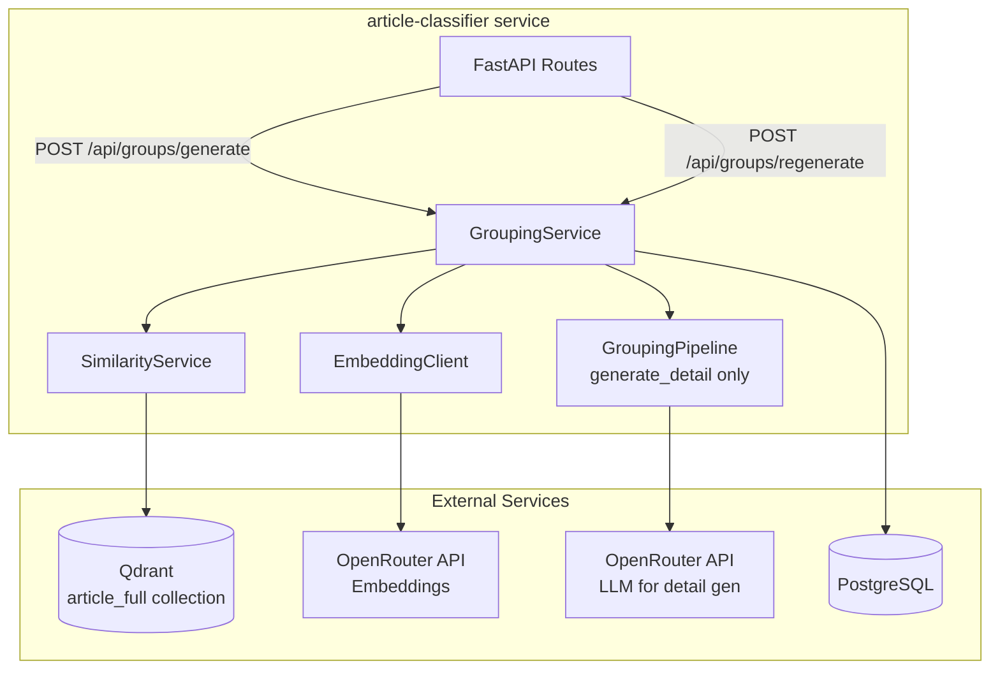
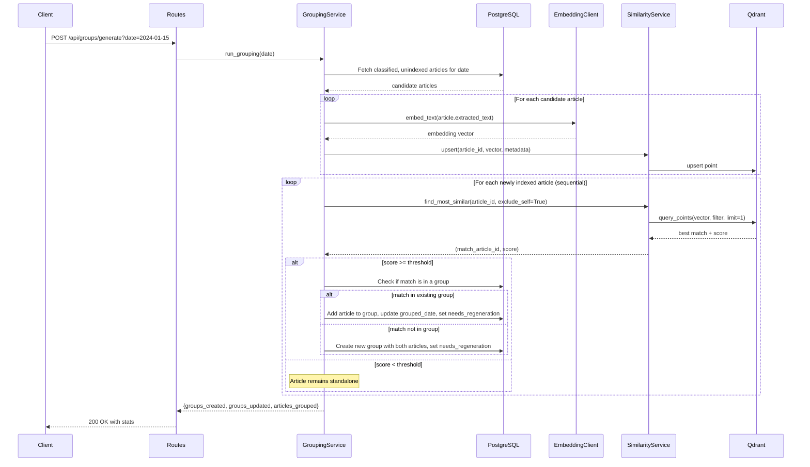
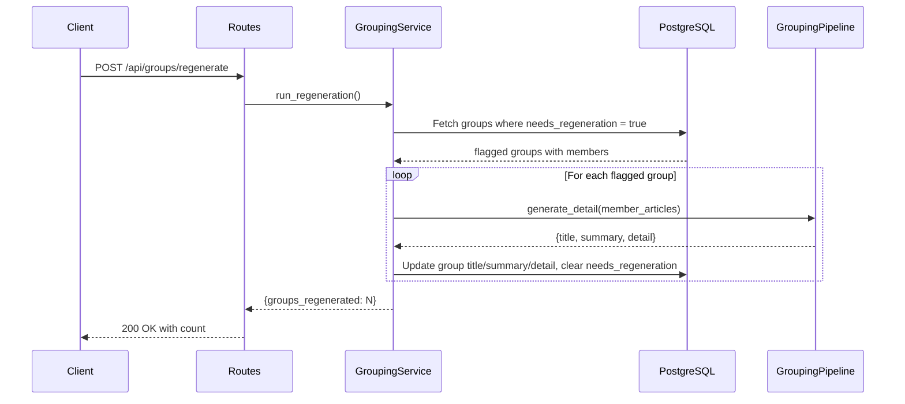

# Design Document: RAG-Based Grouping

## Overview

This design replaces the LLM-based article clustering in the article-classifier service with a vector similarity approach using Qdrant. Instead of sending batches of articles to an LLM for clustering decisions, each article's full `extracted_text` is embedded and stored in a dedicated Qdrant collection (`article_full`). Grouping decisions are made by comparing cosine similarity scores against a configurable threshold.

The key architectural change is that **similarity matching** (determining which articles belong together) becomes a deterministic, threshold-based vector operation, while **detail generation** (producing group title, summary, and detail text) remains an LLM operation triggered separately via a dedicated endpoint.

### Design Rationale

- **Cost reduction**: Eliminates multiple LLM calls per grouping run (clustering + validation). Only the regeneration step uses LLM.
- **Determinism**: Cosine similarity produces consistent, reproducible grouping decisions unlike LLM-based clustering which can vary between runs.
- **Latency**: Vector similarity search is sub-second vs multi-second LLM calls.
- **Separation of concerns**: Grouping (similarity matching) and presentation (detail generation) are decoupled into independent operations with different triggers.

## Architecture



### Flow: `POST /api/groups/generate?date=YYYY-MM-DD`



### Flow: `POST /api/groups/regenerate`



## Components and Interfaces

### 1. EmbeddingClient (`article-classifier/src/embedding_client.py`)

Reuses the pattern from `rag-agent/src/embeddings.py`. An httpx-based client that calls the OpenRouter embeddings API.

```python
class EmbeddingError(Exception):
    pass

class EmbeddingClient:
    def __init__(self, api_url: str, api_key: str, model: str) -> None: ...

    async def embed_text(self, text: str) -> list[float]:
        """Embed a single text string. Returns the embedding vector."""
        ...

    async def embed_texts(self, texts: list[str]) -> list[list[float]]:
        """Embed multiple texts in a single API call. Returns list of vectors."""
        ...
```

### 2. SimilarityService (`article-classifier/src/similarity_service.py`)

Wraps the async Qdrant client for the `article_full` collection. Handles collection creation, point upserting, and similarity queries.

```python
class SimilarityService:
    def __init__(self, qdrant_client, settings) -> None: ...

    async def ensure_collection(self, vector_size: int = 1536) -> None:
        """Create the article_full collection if it doesn't exist."""
        ...

    async def upsert_article(
        self,
        article_id: int,
        vector: list[float],
        metadata: dict,
    ) -> None:
        """Upsert a single article's embedding with metadata."""
        ...

    async def find_most_similar(
        self,
        article_id: int,
        vector: list[float],
        exclude_ids: list[int] | None = None,
    ) -> tuple[int, float] | None:
        """Find the most similar article, excluding the article itself.
        Returns (matched_article_id, score) or None if no results."""
        ...

    @staticmethod
    def make_point_id(article_id: int) -> str:
        """Generate a deterministic UUID5 from article_id."""
        ...
```

**Point ID generation**: Uses `uuid.uuid5(NAMESPACE, f"{article_id}")` with a fixed namespace UUID, ensuring the same article always maps to the same point ID (idempotent upserts).

### 3. GroupingService (`article-classifier/src/grouping_service.py`) — Modified

The existing `GroupingService` is rewritten to use vector similarity instead of LLM clustering. Key changes:

- Remove dependency on `GroupingPipeline.cluster()` and `validate_cluster()`
- Add dependencies on `EmbeddingClient` and `SimilarityService`
- Add `run_regeneration()` method for the regenerate endpoint
- Simplify `run_grouping()` to: fetch candidates → embed → upsert → similarity search → group decisions

```python
class GroupingService:
    def __init__(self, settings) -> None:
        self._embedding_client = EmbeddingClient(...)
        self._similarity_service = SimilarityService(...)
        self._pipeline = GroupingPipeline(settings)  # retained for generate_detail only
        ...

    async def run_grouping(self, target_date: date | None = None) -> GroupingTriggerResponse:
        """Embed unindexed articles, perform similarity matching, create/update groups."""
        ...

    async def run_regeneration(self) -> RegenerationResponse:
        """Regenerate detail text for all groups with needs_regeneration=true."""
        ...
```

### 4. GroupingPipeline (`article-classifier/src/grouping_pipeline.py`) — Simplified

Only `generate_detail()` is retained. The `cluster()`, `validate_cluster()`, `_cluster_node`, and all clustering-related code are removed.

### 5. Routes (`article-classifier/src/routes.py`) — Modified

- Existing `POST /api/groups/generate` endpoint calls the new `run_grouping()` method
- New `POST /api/groups/regenerate` endpoint calls `run_regeneration()`
- All existing GET endpoints remain unchanged

### 6. Config (`article-classifier/src/config.py`) — Extended

New settings added to the existing `Settings` class:

```python
# Qdrant
QDRANT_URL: str = "http://localhost:6333"
QDRANT_API_KEY: str | None = None
QDRANT_FULL_ARTICLE_COLLECTION: str = "article_full"

# Embedding
EMBEDDING_MODEL: str = "openai/text-embedding-3-small"
EMBEDDING_API_URL: str = "https://openrouter.ai/api/v1"

# Grouping threshold
GROUPING_SIMILARITY_THRESHOLD: float = 0.75
```

Threshold validation uses pydantic's `Field(ge=0.0, le=1.0)`.

## Data Models

### Modified: `ArticleGroup` model (`article-classifier/src/models.py`)

Add `needs_regeneration` column:

```python
class ArticleGroup(Base):
    __tablename__ = "article_groups"
    # ... existing columns ...
    needs_regeneration: Mapped[bool] = mapped_column(Boolean, nullable=False, default=False)
```

### New: `FullArticleIndexed` model (`article-classifier/src/models.py`)

Tracks which articles have been embedded and indexed in the `article_full` Qdrant collection:

```python
class FullArticleIndexed(Base):
    __tablename__ = "full_article_indexed"

    article_id: Mapped[int] = mapped_column(
        Integer, ForeignKey("articles.id", ondelete="CASCADE"), primary_key=True
    )
    indexed_at: Mapped[datetime] = mapped_column(DateTime, nullable=False, default=func.now())
```

### New: `RegenerationResponse` schema (`article-classifier/src/grouping_schemas.py`)

```python
class RegenerationResponse(BaseModel):
    groups_regenerated: int
```

### Qdrant Point Structure (in `article_full` collection)

```json
{
  "id": "uuid5(namespace, article_id)",
  "vector": [0.123, -0.456, ...],  // 1536 dimensions
  "payload": {
    "article_id": 42,
    "article_title": "Example Article Title",
    "published_at": "2024-01-15T10:30:00Z",
    "indexed_at": "2024-01-15T12:00:00Z"
  }
}
```

### Database Migration

A SQL migration adds:
1. `needs_regeneration BOOLEAN NOT NULL DEFAULT false` column to `article_groups`
2. `full_article_indexed` table with `article_id` (PK, FK to articles) and `indexed_at`

## Correctness Properties

*A property is a characteristic or behavior that should hold true across all valid executions of a system — essentially, a formal statement about what the system should do. Properties serve as the bridge between human-readable specifications and machine-verifiable correctness guarantees.*

### Property 1: Indexing produces exactly one point per article with deterministic ID and complete metadata

*For any* article with non-empty `extracted_text`, indexing that article into the Full_Article_Collection SHALL produce exactly one point whose ID is deterministically derived from the article_id, and whose payload contains `article_id`, `article_title`, `published_at`, and `indexed_at`. Re-indexing the same article SHALL not create duplicates.

**Validates: Requirements 1.3, 1.4, 1.5**

### Property 2: Only classified, unindexed articles are selected as candidates

*For any* set of articles in the database, the candidate selection function SHALL return only articles that have a classification result AND do not have a corresponding entry in the `full_article_indexed` table. Articles that have already been indexed SHALL never be re-processed.

**Validates: Requirements 2.1, 2.4**

### Property 3: Self-exclusion from similarity search

*For any* article being processed for grouping, the similarity search SHALL never return that article itself as a match. The article's own point must be excluded from query results.

**Validates: Requirements 3.2**

### Property 4: Grouping decision correctness based on threshold and group membership

*For any* article and its best similarity match: if the similarity score is >= threshold AND the match is in an existing group, the article SHALL be added to that group; if the score is >= threshold AND the match is ungrouped, a new group SHALL be created containing both; if the score is < threshold, the article SHALL remain standalone.

**Validates: Requirements 3.4, 3.5, 3.6**

### Property 5: Single-group membership invariant

*For any* set of articles after the grouping process completes, each article_id SHALL appear in at most one group in the `article_group_members` table.

**Validates: Requirements 3.8**

### Property 6: grouped_date reflects most recent member

*For any* Article_Group after a new member is added, the group's `grouped_date` SHALL equal the `published_at` date of the member with the most recent `published_at` value among all members in that group.

**Validates: Requirements 3.9**

### Property 7: needs_regeneration is set on group creation or modification

*For any* Article_Group that was just created or had a new member added during the grouping process, the `needs_regeneration` flag SHALL be `true`.

**Validates: Requirements 3.10**

### Property 8: needs_regeneration is cleared after successful detail regeneration

*For any* Article_Group where detail regeneration succeeds, the `needs_regeneration` flag SHALL be `false` after the regeneration completes.

**Validates: Requirements 4.6**

### Property 9: Threshold monotonicity — higher threshold produces fewer or equal groups

*For any* fixed set of articles and their pairwise similarity scores, running the grouping algorithm with threshold T1 > T2 SHALL produce a number of groups less than or equal to the number produced with threshold T2.

**Validates: Requirements 5.3, 5.4**

### Property 10: Threshold validation rejects values outside [0.0, 1.0]

*For any* float value outside the range [0.0, 1.0], the configuration validation SHALL reject it. *For any* float value within [0.0, 1.0] inclusive, the configuration SHALL accept it.

**Validates: Requirements 5.2**

## Error Handling

| Error Scenario | Handling Strategy |
|---|---|
| Embedding API returns error for one article | Log error, skip that article, continue processing remaining articles. Article is NOT marked as indexed. |
| Embedding API timeout | httpx timeout (60s default). Retry not implemented at embedding level — article is skipped and retried on next run. |
| Qdrant connection failure | Log error, abort the grouping run. Return partial results if some articles were already processed. |
| Qdrant upsert failure for one article | Log error, skip that article, continue with remaining. |
| Similarity search returns no results | Treat as below-threshold (article remains standalone). |
| Duplicate article_id in article_group_members (unique constraint violation) | Log warning, skip that article. This indicates the article was already grouped (race condition or re-run). |
| LLM failure during detail regeneration | Log error, leave `needs_regeneration = true` on that group. Continue processing other groups. |
| Empty extracted_text on article | Skip during indexing, log warning. Do not mark as indexed. |
| Invalid threshold configuration | Pydantic validation rejects at startup — service fails to start with clear error message. |

### Graceful Degradation

- The grouping process is designed to be **idempotent and resumable**. If it fails partway through, already-indexed articles won't be re-embedded on the next run.
- Groups with `needs_regeneration = true` but no detail text will appear in the group list with empty title/summary until regeneration succeeds. The frontend already handles this gracefully since the fields are non-null in the schema (they'll have placeholder values set at creation time).
- For newly created groups (before regeneration), `title` is set to a placeholder like the first member's title, `summary` to an empty string, and `detail` to an empty string.

## Testing Strategy

### Property-Based Testing

This feature is well-suited for property-based testing because the core logic involves:
- Pure decision functions (threshold comparison, group membership logic)
- Deterministic ID generation
- Invariants that must hold across all inputs (single-group membership, date correctness)
- Metamorphic properties (threshold monotonicity)

**Library**: [Hypothesis](https://hypothesis.readthedocs.io/) (already used in this project — see `.hypothesis/` directory)

**Configuration**: Minimum 100 examples per property test.

**Tag format**: `# Feature: rag-based-grouping, Property {N}: {property_text}`

Each correctness property (1–10) maps to a single property-based test that generates random inputs and verifies the property holds universally.

### Unit Tests (Example-Based)

- Embedding client: mock httpx responses, verify correct API call format
- SimilarityService: mock Qdrant client, verify upsert/query calls
- GroupingService sequential processing: verify that article C joins the group created by A+B
- Regeneration endpoint: verify it processes only flagged groups
- Error handling: verify skip-and-continue behavior on embedding failures
- Empty candidate set: verify zero-result response

### Integration Tests

- Full grouping flow with mocked Qdrant and embedding API
- Regeneration flow with mocked LLM
- Existing endpoints (feed, groups, group detail) continue returning correct format
- Database migration: verify `needs_regeneration` column and `full_article_indexed` table exist

### Test Organization

```
article-classifier/
  tests/
    test_embedding_client.py       # Unit tests for EmbeddingClient
    test_similarity_service.py     # Unit + property tests for SimilarityService
    test_grouping_service.py       # Property + unit tests for GroupingService
    test_grouping_properties.py    # Dedicated property-based tests for all 10 properties
    test_routes.py                 # Integration tests for API endpoints
    test_config.py                 # Config validation tests
```
