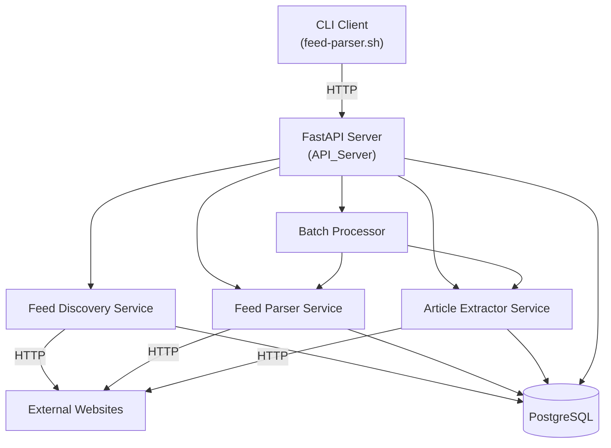
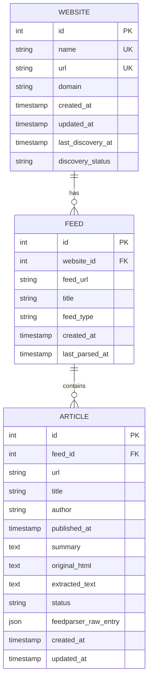

# Design Document: RSS Feed Pipeline

## Overview

The RSS Feed Pipeline is a Python service that discovers RSS/Atom feeds on registered websites, parses feed entries, downloads article HTML, and extracts text using Trafilatura. All operations are exposed as independent REST API endpoints via FastAPI, backed by PostgreSQL for persistence. A CLI client (`feed-parser`) wraps the API for terminal-based workflows.

The system is designed as a sequential pipeline with independently triggerable stages:

```
Register Website → Discover Feeds → Parse Entries → Download & Extract Articles
```

Each stage can be run individually for debugging or as a batch operation for convenience.

### Key Design Decisions

- **Independent stages over background workers**: Each pipeline stage is a synchronous API call rather than a background job queue. This keeps the system simple, debuggable, and avoids the need for Celery/Redis. The tradeoff is that long batch operations block the HTTP response, which is acceptable for a single-user pipeline tool.
- **SQLAlchemy + Alembic over raw SQL**: Provides type-safe models, migration management, and async support via `asyncpg`.
- **httpx over requests**: Native async support, connection pooling, and timeout configuration.
- **Bash CLI with curl over Python Click**: Zero additional dependencies — the CLI is a single shell script that calls the API via curl and formats output with `jq`. Works anywhere bash and curl are available, no Python environment needed on the client side.
- **Flat project structure**: The service has ~6-8 source modules, fitting the flat structure threshold from project rules.

## Architecture



### Request Flow

1. CLI or HTTP client sends request to FastAPI
2. FastAPI routes to the appropriate service
3. Service performs external HTTP calls (if needed) with rate limiting
4. Service reads/writes PostgreSQL via SQLAlchemy async session
5. Response returned to caller

### Rate Limiting Architecture

A per-domain rate limiter tracks the last request timestamp for each domain. Before any external HTTP request, the limiter enforces the configured delay. This is implemented as an in-memory dictionary with domain → last_request_time mapping, wrapped in an async lock for concurrency safety.

## Components and Interfaces

### Project Structure

```
src/
├── main.py                 # FastAPI app entry point, lifespan, middleware
├── config.py               # Environment variable loading, Settings model
├── data/
│   ├── database.py         # SQLAlchemy engine, session factory, Base
│   ├── models.py           # SQLAlchemy ORM models (Website, Feed, Article)
│   └── schemas.py          # Pydantic request/response schemas
├── services/
│   ├── discovery_service.py    # Feed discovery logic
│   ├── parser_service.py       # Feed parsing logic (feedparser)
│   ├── extractor_service.py    # Article download + Trafilatura extraction
│   ├── batch_service.py        # Batch orchestration
│   └── rate_limiter.py         # Per-domain rate limiting
├── routes/
│   ├── websites.py         # /api/websites endpoints
│   ├── feeds.py            # /api/feeds endpoints
│   ├── articles.py         # /api/articles endpoints
│   ├── batch.py            # /api/batch endpoints
│   └── health.py           # /health, /status endpoints
scripts/
├── feed-parser.sh          # Bash CLI script using curl + jq
├── fly-setup.sh
alembic/
├── alembic.ini
├── env.py
└── versions/
Dockerfile
docker-compose.yml
fly.toml
.env.example
.dockerignore
pyproject.toml
README.md
```

The `src/` directory is organized into three subdirectories by responsibility: `data/` for database, ORM models, and schemas; `services/` for business logic; `routes/` for API endpoints. `main.py` and `config.py` remain at the `src/` root as entry point and shared configuration.

### Component Interfaces

#### Feed Discovery Service (`services/discovery_service.py`)

```python
class FeedDiscoveryService:
    def __init__(self, http_client: httpx.AsyncClient, rate_limiter: RateLimiter):
        ...

    async def discover_feeds(self, website: Website, db: AsyncSession) -> list[Feed]:
        """
        Scan website HTML for <link> tags with RSS/Atom types,
        then probe common feed URL patterns.
        Returns list of newly created Feed records.
        Updates website.last_discovery_at and website.discovery_status.
        """
```

Strategy:
1. Fetch the website's homepage HTML
2. Parse `<link rel="alternate" type="application/rss+xml">` and `<link rel="alternate" type="application/atom+xml">` tags
3. Probe common paths: `/feed`, `/rss`, `/atom.xml`, `/feed.xml`, `/rss.xml`, `/index.xml`, `/feeds/all.atom.xml`
4. Validate each candidate URL returns a valid feed content-type or parseable XML
5. Store new feeds, skip existing ones (unique constraint on feed_url + website_id)

#### Feed Parser Service (`services/parser_service.py`)

```python
class FeedParserService:
    def __init__(self, rate_limiter: RateLimiter):
        ...

    async def parse_feed(self, feed: Feed, db: AsyncSession) -> list[Article]:
        """
        Use feedparser to retrieve and parse the feed.
        Create Article records for new entries (matched by URL).
        Returns list of newly created articles.
        Updates feed.last_parsed_at.
        """
```

Extracts from each entry: `title`, `link`, `published`, `author`, `summary`, and stores the raw feedparser entry dict as JSON in `feedparser_raw_entry`.

#### Article Extractor Service (`services/extractor_service.py`)

```python
class ArticleExtractorService:
    def __init__(self, http_client: httpx.AsyncClient, rate_limiter: RateLimiter):
        ...

    async def extract_article(self, article: Article, db: AsyncSession) -> Article:
        """
        Download article HTML, extract text via Trafilatura.
        Updates article.original_html, article.extracted_text, article.status.
        Returns updated article.
        """

    async def extract_feed_articles(self, feed: Feed, db: AsyncSession) -> dict:
        """
        Extract all unprocessed articles for a feed.
        Returns summary dict with counts.
        """
```

Status transitions:
- `pending` → `downloaded` (HTML fetched, extraction failed)
- `pending` → `extracted` (HTML fetched and text extracted)
- `pending` → `failed` (download failed)

#### Batch Processor (`services/batch_service.py`)

```python
class BatchProcessor:
    def __init__(
        self,
        parser_service: FeedParserService,
        extractor_service: ArticleExtractorService,
    ):
        ...

    async def process_website(self, website: Website, db: AsyncSession) -> BatchSummary:
        """
        Parse all feeds for website, then extract all new articles.
        Continues on individual failures.
        Returns BatchSummary with counts and error list.
        """

    async def process_all(self, db: AsyncSession) -> BatchSummary:
        """Process all registered websites."""
```

#### Rate Limiter (`services/rate_limiter.py`)

```python
class RateLimiter:
    def __init__(self, delay_seconds: float = 1.0):
        ...

    async def acquire(self, domain: str) -> None:
        """
        Wait until at least delay_seconds have passed since
        the last request to this domain. Thread/async safe.
        """
```

Uses `asyncio.Lock` per domain and `time.monotonic()` for timing.

### API Endpoints

#### Websites (`/api/websites`)

| Method | Path | Description | Request | Response |
|--------|------|-------------|---------|----------|
| POST | `/api/websites` | Register website + auto-discover feeds | `{name: str, url: str}` | `201 WebsiteResponse` |
| GET | `/api/websites` | List websites | `?page=1&size=20` | `PaginatedResponse[WebsiteResponse]` |
| GET | `/api/websites/{id}` | Get website | — | `WebsiteResponse` |
| DELETE | `/api/websites/{id}` | Delete website | — | `204 No Content` |
| POST | `/api/websites/{id}/discover` | Trigger discovery | — | `DiscoveryResponse` |
| GET | `/api/websites/{id}/feeds` | List feeds | — | `list[FeedResponse]` |
| GET | `/api/websites/{id}/articles` | List articles | `?page&size&status` | `PaginatedResponse[ArticleResponse]` |

#### Feeds (`/api/feeds`)

| Method | Path | Description | Request | Response |
|--------|------|-------------|---------|----------|
| POST | `/api/feeds/{id}/parse` | Parse single feed | — | `ParseResponse` |
| POST | `/api/websites/{id}/parse` | Parse all feeds for website | — | `ParseResponse` |

#### Articles (`/api/articles`)

| Method | Path | Description | Request | Response |
|--------|------|-------------|---------|----------|
| GET | `/api/articles/{id}` | Get article with all fields | — | `ArticleDetailResponse` |
| GET | `/api/feeds/{id}/articles` | List articles for feed | `?page&size&status` | `PaginatedResponse[ArticleResponse]` |
| POST | `/api/articles/{id}/extract` | Extract single article | — | `ArticleDetailResponse` |
| DELETE | `/api/articles/{id}` | Delete article | — | `204 No Content` |
| POST | `/api/feeds/{id}/extract` | Extract all unprocessed for feed | — | `ExtractBatchResponse` |

#### Batch (`/api/batch`)

| Method | Path | Description | Request | Response |
|--------|------|-------------|---------|----------|
| POST | `/api/batch/process` | Process all websites | — | `BatchSummaryResponse` |
| POST | `/api/batch/process/{website_id}` | Process single website | — | `BatchSummaryResponse` |

#### Health (`/`)

| Method | Path | Description | Response |
|--------|------|-------------|----------|
| GET | `/health` | Health check | `200 {status: "ok"}` or `503` |
| GET | `/status` | Pipeline stats | `StatusResponse` |

### CLI Design

The CLI is a single bash script (`scripts/feed-parser.sh`) that calls the API via `curl` and formats output with `jq`. It requires `curl` and `jq` as runtime dependencies.

```
feed-parser add <name> <url>           # Register website
feed-parser list                        # List websites
feed-parser list articles <name>        # List articles for website
feed-parser discover <name>             # Trigger discovery
feed-parser parse <name>                # Parse feeds for website
feed-parser parse --all                 # Parse all
feed-parser extract <name>                # Extract articles for website
feed-parser extract --all                 # Extract all
feed-parser run <name>                  # Pipeline for website (parse, extract)
feed-parser run --all                   # Full pipeline for all
feed-parser article <id>                # Show article details
feed-parser article delete <id>         # Delete article
feed-parser status                      # Pipeline statistics
feed-parser delete <name>               # Delete website
feed-parser help                        # Show all commands
feed-parser help <command>              # Show command details
```

Global flags: `--json` (raw JSON output, skips jq formatting), `--help`

#### Implementation Details

- The script reads `FEED_PARSER_API_URL` from the environment (default: `http://localhost:8000`)
- Name-to-ID resolution: calls `GET /api/websites`, pipes through `jq` to find the matching website by name/domain
- Output formatting: `jq` for JSON pretty-printing and table-like column output
- When `--json` is passed, raw API JSON response is printed to stdout without jq formatting
- Error handling: checks curl exit code and HTTP status code, prints human-readable error with status code to stderr
- Auto-prepends `https://` to URLs missing a protocol prefix
- The script is installed by symlinking or copying to a directory in `$PATH` (e.g., `ln -s $(pwd)/scripts/feed-parser.sh /usr/local/bin/feed-parser`)

#### Script Structure

```bash
#!/bin/sh
# feed-parser.sh — CLI client for RSS Feed Pipeline API

API_URL="${FEED_PARSER_API_URL:-http://localhost:8000}"
JSON_OUTPUT=0

# Helper functions
api_get()    { curl -sf "$API_URL$1"; }
api_post()   { curl -sf -X POST -H "Content-Type: application/json" -d "$2" "$API_URL$1"; }
api_delete() { curl -sf -X DELETE "$API_URL$1"; }
resolve_name() { ... }  # GET /api/websites | jq to find ID by name field

# Command dispatch
case "$1" in
  add)      ... ;;
  list)     ... ;;
  discover) ... ;;
  parse)    ... ;;
  extract)  ... ;;
  run)      ... ;;
  article)  ... ;;
  status)   ... ;;
  delete)   ... ;;
  help|--help) ... ;;
  *)        usage ;;
esac
```

## Data Models

### Database Schema



### SQLAlchemy Models

#### Website

| Column | Type | Constraints |
|--------|------|-------------|
| id | Integer | PK, autoincrement |
| name | String(100) | NOT NULL, UNIQUE |
| url | String(2048) | NOT NULL, UNIQUE |
| domain | String(255) | NOT NULL, indexed |
| created_at | DateTime | NOT NULL, default=utcnow |
| updated_at | DateTime | NOT NULL, default=utcnow, onupdate=utcnow |
| last_discovery_at | DateTime | nullable |
| discovery_status | String(20) | NOT NULL, default="pending" |

`discovery_status` values: `pending`, `found`, `not_found`, `error`

#### Feed

| Column | Type | Constraints |
|--------|------|-------------|
| id | Integer | PK, autoincrement |
| website_id | Integer | FK(website.id), NOT NULL, indexed |
| feed_url | String(2048) | NOT NULL |
| title | String(500) | nullable |
| feed_type | String(10) | nullable (rss, atom) |
| created_at | DateTime | NOT NULL, default=utcnow |
| last_parsed_at | DateTime | nullable |

Unique constraint: `(website_id, feed_url)`

#### Article

| Column | Type | Constraints |
|--------|------|-------------|
| id | Integer | PK, autoincrement |
| feed_id | Integer | FK(feed.id), NOT NULL, indexed |
| url | String(2048) | NOT NULL |
| title | String(1000) | nullable |
| author | String(500) | nullable |
| published_at | DateTime | nullable |
| summary | Text | nullable |
| original_html | Text | nullable |
| extracted_text | Text | nullable |
| status | String(20) | NOT NULL, default="pending", indexed |
| feedparser_raw_entry | JSON | nullable |
| created_at | DateTime | NOT NULL, default=utcnow |
| updated_at | DateTime | NOT NULL, default=utcnow, onupdate=utcnow |

Unique constraint: `(feed_id, url)`

`status` values: `pending`, `downloaded`, `extracted`, `failed`

### Pydantic Schemas

Key response schemas:

```python
class WebsiteResponse(BaseModel):
    id: int
    name: str
    url: str
    domain: str
    created_at: datetime
    discovery_status: str

class FeedResponse(BaseModel):
    id: int
    website_id: int
    feed_url: str
    title: str | None
    feed_type: str | None
    last_parsed_at: datetime | None

class ArticleResponse(BaseModel):
    id: int
    feed_id: int
    url: str
    title: str | None
    author: str | None
    published_at: datetime | None
    status: str

class ArticleDetailResponse(ArticleResponse):
    summary: str | None
    original_html: str | None
    extracted_text: str | None
    feedparser_raw_entry: dict | None

class PaginatedResponse(BaseModel, Generic[T]):
    items: list[T]
    total: int
    page: int
    size: int
    pages: int

class BatchSummaryResponse(BaseModel):
    feeds_parsed: int
    articles_discovered: int
    articles_extracted: int
    errors: list[str]

class ErrorResponse(BaseModel):
    error: str
    message: str
    request_id: str | None
    details: list[dict] | None  # field-level validation errors
```


## Correctness Properties

*A property is a characteristic or behavior that should hold true across all valid executions of a system — essentially, a formal statement about what the system should do. Properties serve as the bridge between human-readable specifications and machine-verifiable correctness guarantees.*

### Property 1: Website registration creates a record

*For any* valid URL or domain string, submitting it to the registration endpoint should return a response containing an `id` and the normalized URL, and a subsequent lookup by that ID should return the same record.

**Validates: Requirements 1.1**

### Property 2: Website registration is idempotent

*For any* valid URL, registering it N times (N ≥ 1) should always return the same website ID, and the total count of websites with that URL should remain exactly 1.

**Validates: Requirements 1.2, 6.5**

### Property 3: Invalid input returns validation error

*For any* string that is not a valid URL or domain (empty strings, strings without a TLD, strings with only special characters, whitespace-only strings), submitting it to the registration endpoint should return HTTP 422 with a JSON body containing `error` and `message` fields.

**Validates: Requirements 1.3, 9.3**

### Property 4: Pagination returns correct totals

*For any* set of N registered websites and any page size S > 0, requesting page P should return at most S items, the `total` field should equal N, and `pages` should equal ceil(N / S).

**Validates: Requirements 1.4**

### Property 5: Delete removes website

*For any* registered website, deleting it by ID should result in a subsequent GET for that ID returning 404, and the total website count decreasing by 1.

**Validates: Requirements 1.5**

### Property 6: Feed discovery extracts and stores feed links from HTML

*For any* HTML document containing one or more `<link rel="alternate" type="application/rss+xml">` or `<link rel="alternate" type="application/atom+xml">` tags, running feed discovery should store each linked feed URL in the database associated with the correct website.

**Validates: Requirements 2.1, 2.3**

### Property 7: Discovery network errors preserve existing data

*For any* website that already has discovered feeds, if a subsequent discovery attempt encounters a network error, the existing feed records should remain unchanged in the database.

**Validates: Requirements 2.5**

### Property 8: Feed parsing extracts all metadata fields

*For any* valid RSS/Atom feed entry containing title, link, published date, author, and summary, parsing the feed should produce an article record where each of those fields matches the feed entry's values.

**Validates: Requirements 3.2**

### Property 9: Feed parsing is idempotent

*For any* feed, parsing it N times (N ≥ 1) should produce the same set of article records. The article count for that feed should not increase after the first parse, and existing article data should not be overwritten.

**Validates: Requirements 3.3, 3.4**

### Property 10: Article extraction stores HTML and extracts text with correct status

*For any* article whose URL returns valid, extractable HTML, after extraction: `original_html` should be non-null, `extracted_text` should be non-null, and `status` should be `"extracted"`.

**Validates: Requirements 4.1, 4.3, 4.4**

### Property 11: Unique constraints prevent duplicates at database level

*For any* pair of feeds belonging to the same website with identical `feed_url`, or any pair of articles belonging to the same feed with identical `url`, attempting to insert the second record should be rejected by the database unique constraint.

**Validates: Requirements 6.5**

### Property 12: Batch processing covers all feeds and new articles

*For any* website with N feeds, batch processing should parse all N feeds and attempt to extract all newly discovered articles. The batch summary's `feeds_parsed` count should equal N.

**Validates: Requirements 5.1, 5.2**

### Property 13: Batch summary accurately reports counts including errors

*For any* batch run where K out of M articles fail during extraction, the summary should report `articles_extracted = M - K`, and `errors` should contain exactly K entries. The batch should not abort early.

**Validates: Requirements 5.3, 5.4**

### Property 14: Article status filtering returns only matching articles

*For any* set of articles with mixed statuses and any status filter value from {pending, downloaded, extracted, failed}, the filtered listing endpoint should return only articles whose status matches the filter, and the count should equal the number of articles with that status in the database.

**Validates: Requirements 7.2, 7.3, 7.4**

### Property 15: Status endpoint returns accurate counts

*For any* database state with W websites, F feeds, and A articles (broken down by status), the `/status` endpoint should return counts matching the actual database totals.

**Validates: Requirements 8.3**

### Property 16: Error responses have consistent structure

*For any* API request that results in an error (4xx or 5xx), the response body should be valid JSON containing at minimum `error` and `message` string fields.

**Validates: Requirements 9.1**

### Property 17: Rate limiter enforces per-domain delay

*For any* sequence of N requests to the same domain, the elapsed time between consecutive requests should be greater than or equal to the configured `REQUEST_DELAY_SECONDS`.

**Validates: Requirements 10.1**

### Property 18: User-Agent header is sent on all external requests

*For any* outgoing HTTP request made by the pipeline to an external website, the `User-Agent` header should be present and match the configured `USER_AGENT` value.

**Validates: Requirements 10.2**

### Property 19: 429 responses trigger retry-after delay

*For any* external HTTP request that receives a 429 response with a `Retry-After` header, the next request to that domain should be delayed by at least the specified retry-after duration.

**Validates: Requirements 10.3**

### Property 20: CLI auto-prepends https:// to bare URLs

*For any* URL string that does not start with `http://` or `https://`, the CLI `add` command should prepend `https://` before sending the request to the API.

**Validates: Requirements 12.3**

### Property 21: CLI --json flag outputs valid JSON

*For any* CLI command invoked with the `--json` flag, the stdout output should be parseable as valid JSON.

**Validates: Requirements 12.18**

### Property 22: CLI displays API errors with status code

*For any* API error response received by the CLI, the CLI output should contain the HTTP status code and the error message from the response body.

**Validates: Requirements 12.17**

### Property 23: OpenAPI spec has summaries and schemas for all endpoints

*For any* endpoint defined in the OpenAPI specification, the endpoint should have a non-empty `summary` field and at least one response schema defined.

**Validates: Requirements 13.3**

## Error Handling

### API Error Response Format

All API errors return a consistent JSON structure:

```json
{
  "error": "validation_error",
  "message": "Invalid URL format",
  "request_id": "req_abc123",
  "details": [
    {"field": "url", "message": "URL must contain a valid domain with TLD"}
  ]
}
```

- `error`: Machine-readable error code (e.g., `validation_error`, `not_found`, `network_error`, `internal_error`)
- `message`: Human-readable description
- `request_id`: Unique ID generated per request via middleware (UUID4)
- `details`: Optional field-level validation errors (present on 422 responses)

### HTTP Status Code Mapping

| Scenario | Status Code | Error Code |
|----------|-------------|------------|
| Invalid request body / params | 422 | `validation_error` |
| Resource not found | 404 | `not_found` |
| Network error during crawling | 502 | `network_error` |
| Feed parsing failure | 502 | `parse_error` |
| Trafilatura extraction failure | 422 | `extraction_error` |
| Database unavailable | 503 | `service_unavailable` |
| Unhandled exception | 500 | `internal_error` |

### Error Handling Strategy by Component

#### FastAPI Middleware
- Generates `request_id` (UUID4) for every request, adds to response headers and log context
- Global exception handler catches unhandled exceptions, logs full traceback, returns 500 with `request_id`
- Pydantic validation errors are caught and reformatted into the standard error structure with field-level details

#### Feed Discovery Service
- Network errors (connection refused, timeout, DNS failure): returns error response, does NOT modify existing feed records
- HTML parsing errors (malformed HTML): logs warning, continues with common URL probing
- Updates `website.discovery_status` to `"error"` on failure

#### Feed Parser Service
- Feed URL unreachable: returns error with details, does not create partial records
- Invalid feed content (not valid XML/RSS/Atom): returns error with feedparser's bozo exception details
- Individual entry parsing errors: logs warning, skips entry, continues with remaining entries

#### Article Extractor Service
- Download failure (timeout, 4xx, 5xx): sets `article.status = "failed"`, stores error message
- Trafilatura extraction returns None: sets `article.status = "downloaded"`, stores original HTML only
- Successful extraction: sets `article.status = "extracted"`, stores both HTML and text

#### Batch Processor
- Individual article/feed failures do NOT abort the batch
- Each failure is logged and added to the `errors` list in the summary
- Summary always returned, even if all items fail

### Structured Logging

Uses Python's `structlog` library for structured JSON logging:

```python
import structlog

logger = structlog.get_logger()

# Example log output
logger.info("feed_parsed", feed_id=42, articles_found=15, new_articles=3)
# {"timestamp": "2024-01-15T10:30:00Z", "level": "info", "component": "parser_service", "feed_id": 42, "articles_found": 15, "new_articles": 3}
```

Log context includes: `timestamp`, `level`, `component`, `request_id` (when in request context), and relevant entity IDs (`website_id`, `feed_id`, `article_id`).

## Testing Strategy

### Testing Framework

- **Unit/Integration tests**: `pytest` with `pytest-asyncio` for async test support
- **Property-based tests**: `hypothesis` (the standard PBT library for Python)
- **HTTP mocking**: `respx` (for mocking httpx async client)
- **Database testing**: `pytest` fixtures with test PostgreSQL database, transactions rolled back after each test

### Dual Testing Approach

Both unit tests and property-based tests are required for comprehensive coverage:

- **Unit tests** verify specific examples, edge cases, integration points, and error conditions
- **Property tests** verify universal properties across randomly generated inputs

### Property-Based Testing Configuration

- Library: `hypothesis`
- Minimum iterations: 100 per property (`@settings(max_examples=100)`)
- Each property test references its design document property with a tag comment
- Tag format: `# Feature: rss-feed-pipeline, Property {number}: {property_text}`
- Each correctness property is implemented by a single `@given` test function

### Test Organization

```
tests/
├── conftest.py              # Shared fixtures (db session, http client, test app)
├── test_models.py           # Schema/model unit tests (Req 6)
├── test_config.py           # Configuration loading tests (Req 11)
├── test_discovery.py        # Discovery service unit + property tests (Req 2)
├── test_parser.py           # Parser service unit + property tests (Req 3)
├── test_extractor.py        # Extractor service unit + property tests (Req 4)
├── test_batch.py            # Batch processor unit + property tests (Req 5)
├── test_rate_limiter.py     # Rate limiter property tests (Req 10)
├── test_websites_api.py     # Website endpoint tests (Req 1, 7)
├── test_articles_api.py     # Article endpoint tests (Req 4, 7)
├── test_health_api.py       # Health/status endpoint tests (Req 8)
├── test_error_handling.py   # Error response structure tests (Req 9)
├── test_cli.sh              # CLI bash script tests (Req 12)
└── test_openapi.py          # OpenAPI spec completeness tests (Req 13)
```

### Unit Test Focus Areas

- Specific examples: registering a known URL, parsing a known RSS feed XML snippet
- Edge cases: empty feed, feed with no entries, article with unreachable URL, Trafilatura returning None
- Error conditions: network timeouts, invalid XML, database constraint violations, missing env vars
- Integration: CLI → API → Service → DB round trips

### Property Test Focus Areas

Each property from the Correctness Properties section maps to one `@given` test:

| Property | Test File | Generator Strategy |
|----------|-----------|-------------------|
| P1: Registration creates record | test_websites_api.py | `st.from_regex(url_pattern)` |
| P2: Registration idempotent | test_websites_api.py | `st.from_regex(url_pattern)` + repeat |
| P3: Invalid input → 422 | test_websites_api.py | `st.text()` filtered to invalid URLs |
| P4: Pagination totals | test_websites_api.py | `st.integers(1, 100)` for count and page size |
| P5: Delete removes | test_websites_api.py | Generated website records |
| P6: Discovery extracts links | test_discovery.py | Generated HTML with random `<link>` tags |
| P7: Discovery errors preserve data | test_discovery.py | Pre-populated feeds + simulated errors |
| P8: Parsing extracts metadata | test_parser.py | Generated RSS/Atom XML entries |
| P9: Parsing idempotent | test_parser.py | Generated feed XML, parsed twice |
| P10: Extraction stores HTML + text | test_extractor.py | Generated HTML content |
| P11: Unique constraints | test_models.py | Duplicate record pairs |
| P12: Batch covers all feeds | test_batch.py | Generated website with N feeds |
| P13: Batch summary accuracy | test_batch.py | Mix of succeeding/failing articles |
| P14: Status filtering | test_articles_api.py | Articles with random statuses + filter |
| P15: Status endpoint counts | test_health_api.py | Random DB state |
| P16: Error response structure | test_error_handling.py | Various error-triggering requests |
| P17: Rate limiter delay | test_rate_limiter.py | Sequence of domain requests |
| P18: User-Agent header | test_rate_limiter.py | Captured outgoing requests |
| P19: 429 retry-after | test_rate_limiter.py | Mocked 429 responses |
| P20: CLI https:// prepend | test_cli.sh | URLs without protocol prefix |
| P21: CLI --json valid JSON | test_cli.sh | All commands with --json flag |
| P22: CLI error display | test_cli.sh | Mocked API error responses |
| P23: OpenAPI completeness | test_openapi.py | Iterate all spec endpoints |
